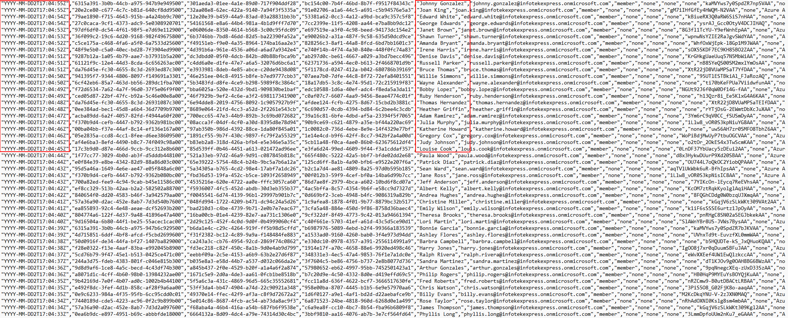
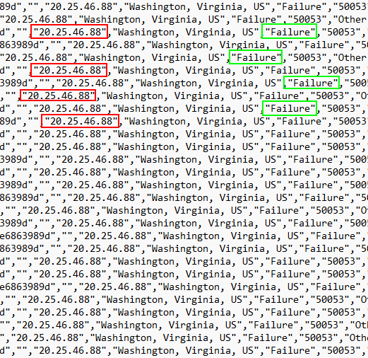
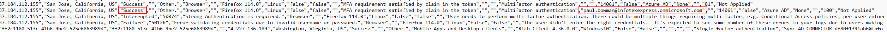
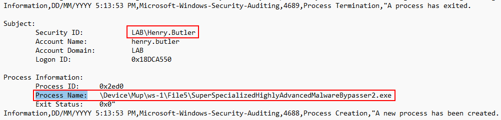
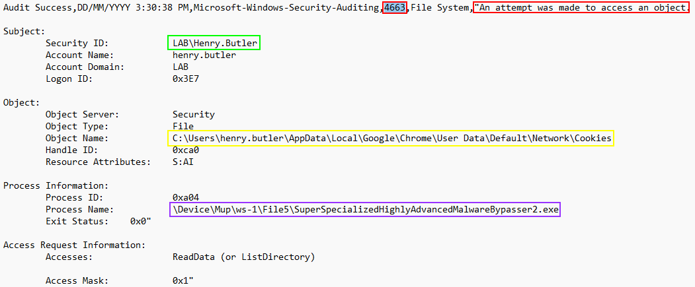
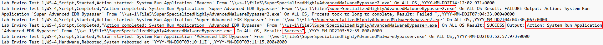

---

This is a lab from **John Strand**'s **Information Security Core Skillss** Course:

https://www.antisyphontraining.com/product/information-security-core-skills-tm/

---

# Azure AD Lab - Hackable MSP
### Lab Objective
In this lab we will navigate through log files of an attack simulation on an MSP to illustrate how an attacker got in and compromised the network. From initial intrusion all the way to full network exploitation, we are going to explore the techniques used by the attacker(s) and how they were able to compromise our Azure MSP

## Downloading The Logs
Before we begin, we need to download the logs to follow along. Although we could have you do it on your host system, we have a fancy VM... so why not use it?

Start by opening up a Command Prompt:

Next, navigate into your `Downloads` directory:
<pre>cd Downloads</pre>

Then, run the following to download the .ZIP file of logs:
<pre>curl -O https://freelabfridays.com/uploads/media/docs/azureir-files-135ffd6c797f4cf5af044333a29cc717.zip</pre>

When it's complete, open up your file directory and unzip the folder!

Now we have the logs on our VM rather than our host system.

## Lab 1 - Initial Intrusion
### Azure login activity logs

[*Download the log file to follow along*](./logs/InteractiveSignIns_Domain_spray_logs.csv)

In this **walkthrough** we will be taking a look at a log file that was pulled from **Azure**.

[Azure](https://azure.microsoft.com/en-us) is a service provided by Microsoft to move a **Domain** into the cloud. While we know the **Domain Controller** records logins if the user used Azure, we need to pull logs to see the failed, attempted, and successful logins.

Our goal is to find how attackers may have initially accessed our **domain network**.

When we first crack open our log file in **notepad**, we notice a few things. First, this log file contains **IP addresses**. This is useful for us trying to identify which systems are logging into which **account**. This logging supplies the time stamp, the account attempting to be accessed, and how they accessed us. With this in mind let’s continue our investigation.

After scrolling down for a bit, the first thing we should notice is the number of logins all within **seconds** of each other. The chances of every employee attempting to login at the same exact time is nearly **impossible**. This could be an indication that someone is trying to **brute force** login credentials.

Let's look closer at the **remote IP addresses**. If they're all the same IP that can give us an indication that either one person is trying to login to all of these accounts or that all the employees are logging in from the same network **(possible, not probable)**.

All of these **logins** that are within a few seconds of each other come from the same exact **IP**. If you look closer, you can see that **almost all** attempts failed.

That is not a good sign.  That means that someone was doing a [brute force spray attack](https://owasp.org/www-community/attacks/Password_Spraying_Attack) at our **domain**. But there's nothing to worry about as long as no user got compromised right?

Let's go through the logs and make sure all attempts are **failed** before we escalate this incident.

[Found Creds](./images/found_creds.PNG)

It looks like **Paul Bowman’s** password was discovered by an attacker during this domain spray. Did the attacker realize that the password was correct and log in? Let's look above all the attempted logins for any activity from **Paul Bowman**.

It looks like the attacker found his way into the domain through **Paul Bowman's** login information. We can see the success message from a login attempt to the domain.

>[!IMPORTANT]
>Always when an attack has occured, look for **persistance** and **lateral movement**, ALWAYS!

## Lab 2 - Machine Pivoting
### Suspicious Executables and Workstations

[*Download the log file to follow along*](./logs/ws-3-security.csv)

After the discovery of the compromised user, **(Paul Bowman)**, we decided to go through the security logs of each workstation to look for any suspicious files being run or used by other users.

The compromised user may try to **pivot** to other computers and try to gain access to other systems. [Pivoting](https://www.geeksforgeeks.org/pivoting-moving-inside-a-network/) is a technique used by an attacker to try to compromise additional systems and try to escalate there privileges from a regular user to an **administrator**. So, where do we start? **Workstation 3** has suspicious activity in its security log files we should take a look at.

>[!NOTE]
>The log file for this portion is a different file. Please **download** it above.

**Open** the log file in notepad and press `ctrl + f` and type `Process Name:` and hit `Enter` then `Tab` to every executable that has run on the **workstation**.

We are looking for **anything out of the ordinary**. We are starting on process names because it is the most likely attack vendor. If any **malicious files** were ran it may be in the audit logs. As a way to confirm strange behavior.  We should also look to see if the user running the file is anyone other than **Paul Bowman**. This can help us understand if the attacker tried to spread through our network.

After tabbing through the log file and carefully looking over **executables** we should take note of this...

At first it may not be totally obvious, but the name seems *slightly* suspicious and is not a normal system file like **mmc** or **event viewer**. It looks like the file was served through a file share on **Workstation 1**, which was the machine that **Paul Bowman** was using. It is also important to take notice of the username, the attacker has moved from Paul into a **new** user. This means the attacker was **pivoting** in this environment.

## Lab 3 - Cookie Theft
### Cookie Theft and RMM (Realtime Monitoring and Management) Takeover

[*Download the log file to follow along*](./logs/cookie_theft.csv)

At this point we know that the attacker is trying to **pivot** in the network.

If the attacker got another user to run a **malicious file**, what will they do next? Well, this user was a slightly more privileged user and may have access to information an attacker may want.

Let's take the **security logs** from the workstation that **Paul Bowman** pivoted to and see if we can see what the malicious executable is doing. 

>[!NOTE] 
>Once again, the logs file is unique. Please **download** with the link above and open with notepad or another text editor.**

If the attacker is running commands and scripts to access **sensitive information** our audit logs should contain evidence of what happened.

The Audit number that indicates something has attempted to access an object is **"4663"**. Use **"ctrl + f"** and type **"4663"** and tab through the logs. If the attacker did access a sensitive file, it will have the process name of **"SuperSpecializedHighlyAdvancedMalwareBypasser2.exe"**.

We have found a very important **Audit** event.

<pre>
Contains Process 4663 and the text "An attempt was made to access an object". This indicates that someone has tried
to access something, but we need more information to go off of to get the full story.
</pre>

<pre>
Contains the username henry.butler. We know already that henry.butler was the next user to get compromised.
</pre>

<pre>
This shows the directory accessed. It looks like something has accessed the cookies of Google Chrome, but the only
program that should do that is Chrome itself. If another program has accessed it, then we know that the users'
cookies have
been stolen.
</pre>

<pre>
Shows which program accessed the folder and files. It looks like "SuperSpecializedHighlyAdvancedMalwareBypasser2.exe"
is the culprit. This is not good. The attacker has just stolen the cookies for henry.butler who we know has access
to our RMM.
</pre>

 

It looks like the attacker is dumping the **users'** cookies to gain access to accounts on the web. Does this user have access to any important accounts or frameworks? **Yes!**  This user has access to a **RMM** that manages the domain. If an attacker gains access to the RMM, then all of our computers may get taken over.

Not to worry though, right? Most **RMM** uses **MFA** and there's nothing to worry about.

Right?

Unfortunately, the cookie theft and reuse occur attackers are hijacking a session that already went through **MFA**, so the attacker can effectively bypass **MFA**. But before we panic let's check our **RMM** logs and see if the attacker has done anything.

## Lab 4 - Full Domain PWN
### What has the attacker done with RMM access?

[*Download the log file to follow along*](./logs/Activities-rmm.csv)

At this point in our investigation, it is becoming clear that the attacker didn't just **compromise** one machine but may have compromised the **entire** domain.

An **RMM** is a tool that is used to remote manage and monitor workstations. Most **RMMs** have the capability to access the **CLI** of a workstation and push automated scripts to assist an **IT admin** help push updates en mass.

Let's crack open the **log** and confirm our worst fears and suspicions.

>[!NOTE]
>Once again, the logs file is unique to this part of the lab. Please **download** with the link above and open in notepad or another text editor.

It is worth noting the lack of logs here, since these **RMM** logs are mainly recording its own activity. It is not logging the data from the **computer it's connected to**.  We can see that a **script** has recently been run.

It looks like the attacker has pushed a script to **execute malware** on every machine with the **RMM** tool running on it, including the **domain controller**.

It is safe to assume that every single machine on the network is **compromised**, which is not good.

This **small** breach has just become a **huge** disaster and will need **Escalation** and **Incident Response**.