# F4keH0und

# Both VMs

## Lab Goal

The goal of this lab is to demonstrate how identity-based deception using **F4keH0und** can help detect suspicious activity in Active Directory.

We will collect and analyse Active Directory data with SharpHound and F4keH0und, deploy a recycled **KerberoastableUser** decoy, and investigate the resulting Kerberos service-ticket request through **Event ID 4769** on the Domain Controller.

The focus is not on compromising the decoy, but on understanding how believable identity-based deception can expose suspicious enumeration and credential-access activity.

## In This Lab You Will

- Collect and analyse Active Directory information with SharpHound and F4keH0und.
- Perform a dry run and deploy a recycled **KerberoastableUser** decoy.
- Enumerate the domain from Ubuntu, discover the decoy, and request a Kerberos service ticket.
- Analyse **Event ID 4769** and correlate it with the F4keH0und deployment.

## What Is F4keH0und?

F4keH0und is a PowerShell framework for deploying deception objects in Active Directory and Microsoft Entra ID. It analyses data from tools like SharpHound and AzureHound to identify where decoys are most likely to attract attacker attention.

It modifies existing Active Directory objects, prioritising stale or disabled entries because they already have realistic creation dates, identifiers, and history.

## Identity-Based Deception in Active Directory

Identity-based deception uses fake or repurposed Active Directory identities to attract suspicious activity. These decoys mimic real users, service accounts, or privileged systems.

Unlike traditional honeypots, they do not require separate infrastructure and instead exist as normal AD objects, making them discoverable through standard LDAP enumeration.

A good decoy should be:

- **Discoverable**, so that attackers can find it during enumeration.
- **Believable**, so that it does not immediately appear artificial.
- **Attractive**, so that it appears to provide useful access or privileges.
- **Monitored**, so that interaction with it produces evidence that defenders can investigate.

In this lab, the decoy is a service account with an SPN. When a Kerberos service ticket is requested for it, the domain controller logs the activity.

Windows records **Event ID 4769** for every Kerberos Ticket Granting Service request, including details such as the requesting account, service, and source host.

While 4769 events are normally common in Active Directory, requests targeting a decoy service are strong indicators of suspicious enumeration or Kerberoasting activity.

## Recycling and the RID Anomaly

Every Active Directory security principal is identified by a Security Identifier (SID). For domain accounts, the SID includes the domain identifier and a Relative Identifier (RID), which uniquely identifies the object within the domain.

Example:

```text
S-1-5-21-111111111-222222222-333333333-1152
                                           └── RID
```

When a new object is created, Active Directory assigns a SID with a RID from the domain’s pool and sets a `whenCreated` timestamp.

This can be used for detection. If an account appears “legacy” but has a high RID and a recent creation date, it may be flagged as a decoy. F4keH0und calls this the **RID anomaly**.

To avoid this, F4keH0und recycles existing stale or disabled objects instead of creating new ones. This preserves the original SID, RID, and `whenCreated` values, making the decoy appear more natural.

This is not RID reuse. Active Directory never reassigns a deleted SID. Recycling simply modifies an existing object rather than creating a new one.

## F4keH0und Decoy Types

F4keH0und supports several decoy types designed to attract different Active Directory attack techniques.

### StaleAdminLure

The **StaleAdminLure** repurposes a disabled or previously privileged user account and makes it appear valuable to attackers searching for dormant administrative identities.

An unexpected authentication attempt or interaction with this account can provide evidence that someone is targeting privileged users.

### KerberoastableUser

The **KerberoastableUser** decoy repurposes a stale user account and assigns it an attractive Service Principal Name, such as one representing a database or application service.

Attackers searching for accounts with SPNs can discover the account and request a Kerberos service ticket for it. The request is then recorded as **Event ID 4769** on the domain controller.

**This is the decoy type we will use in this lab.**

### UnconstrainedDelegationComputer

The **UnconstrainedDelegationComputer** decoy repurposes a stale computer object and makes it appear to have unconstrained Kerberos delegation enabled.

This configuration is attractive to attackers because unconstrained delegation can be associated with credential theft and privilege-escalation opportunities.

### DNSAdminUser

The **DNSAdminUser** decoy repurposes a stale user and places it in the privileged **DnsAdmins** group.

Attackers enumerating privileged group memberships may identify the account as a possible route toward increased domain access.

### ACLAttackPath

The **ACLAttackPath** decoy creates a synthetic chain of permissions between recycled Active Directory objects.

The relationships are designed to appear in BloodHound attack-path analysis. An attacker following the apparent privilege-escalation path is directed toward monitored decoy identities and relationships.

## Preparing Active Directory

In the Windows VM, open PowerShell and navigate to the lab folder.


```powershell
cd "C:\Users\Administrator\Desktop\Labs\F4keH0und\"
```

Then execute the PowerShell scripts to setup the Active Directory environment.

```powershell
.\AD_Structure.ps1
```

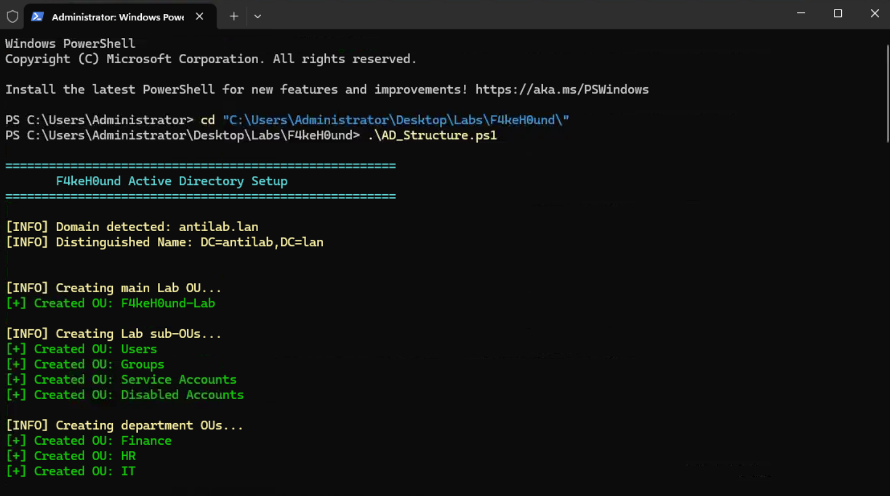

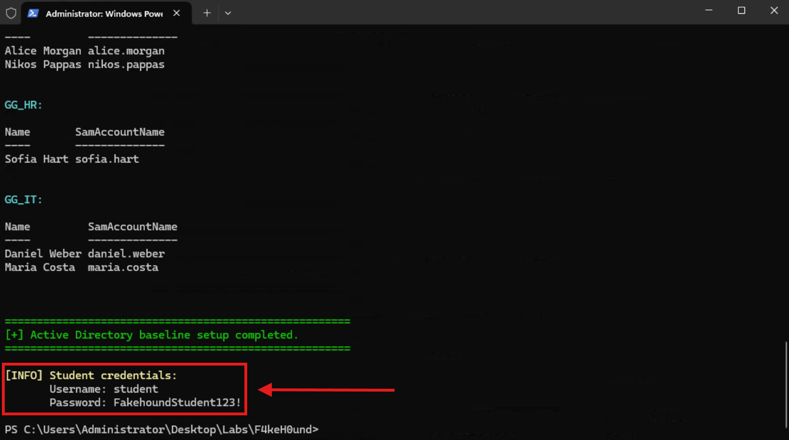

This script creates an Organizational Unit called **F4keH0und-Lab** and populates it with the OUs, groups, and user objects required for the lab.

At the end of the script execution, the credentials for the student user are provided. We will use them later during the Active Directory enumeration phase, so save them somewhere easily accessible.

During the enumeration phase, we will perform Kerberoasting from the Ubuntu VM. This requires valid domain credentials, which are provided through the student account.

Next, execute the PowerShell script that creates the stale Active Directory object required by F4keH0und.

```powershell
.\Stale_User_Creation.ps1
```

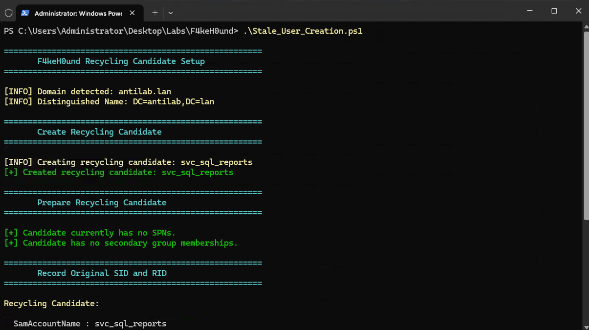

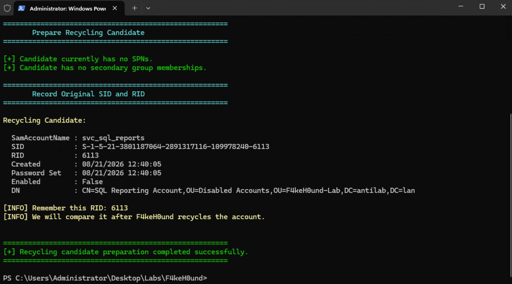

The script creates a stale service account that F4keH0und will later recycle and transform into our Kerberoastable decoy.

The Active Directory environment is now ready. We can verify it by opening the **Active Directory Administrative Center**.

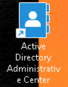

Press the arrow next to `antilab (local)` to expand the domain, and then select the **F4keH0und-Lab** OU.

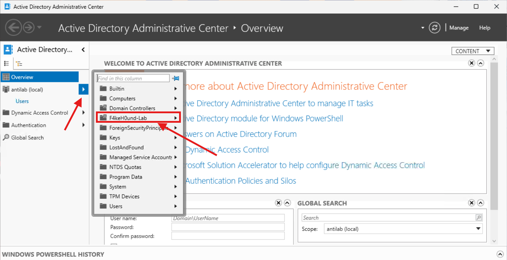

We can now navigate through the created OUs and inspect the Active Directory objects and their properties.

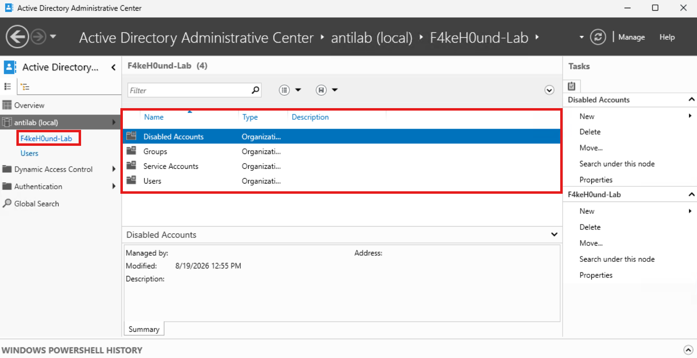

The Active Directory environment has the following structure.

```text
antilab.lan
└── F4keH0und-Lab
    ├── Users
    │   ├── student
    │   ├── Finance
    │   │   ├── alice.morgan
    │   │   └── nikos.pappas
    │   ├── HR
    │   │   └── sofia.hart
    │   └── IT
    │       ├── daniel.weber
    │       └── maria.costa
    │
    ├── Groups
    │   ├── GG_Finance
    │   ├── GG_HR
    │   └── GG_IT
    │
    ├── Service Accounts
    │
    └── Disabled Accounts
        └── svc_sql_reports
```

## Ubuntu VM Setup

Open an Ubuntu terminal and navigate to the lab folder.


```bash
cd ~/ADCD/F4keH0und/
```

Before executing the configuration script, obtain the IP address of the Windows VM. In the Windows VM, open PowerShell and execute:

```powershell
ipconfig
```

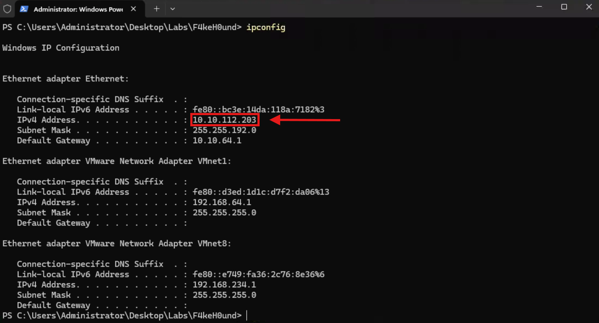

Now return to the Ubuntu terminal and execute the configuration script:

```bash
./conf_script.sh
```

When prompted for the Windows Domain Controller IP address, enter the IP address obtained in the previous step.

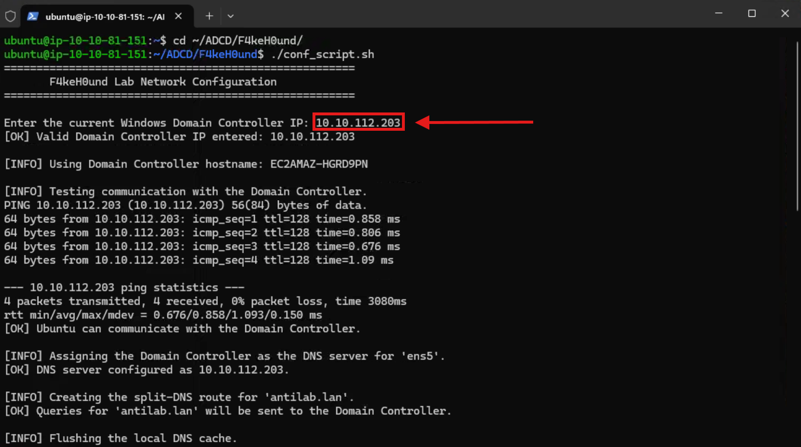

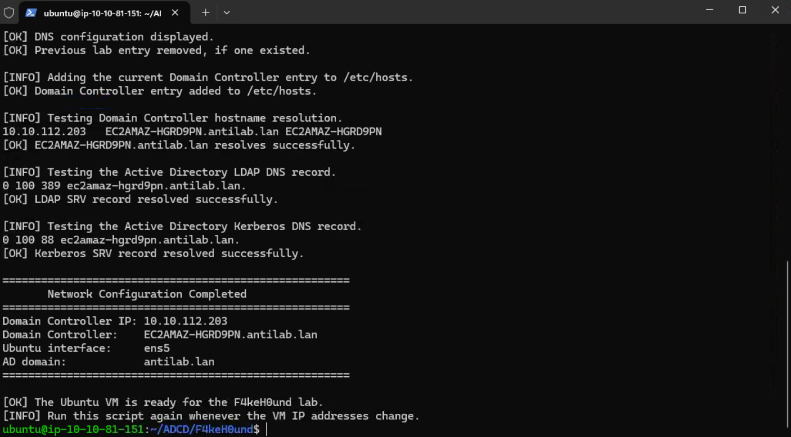

This script configures the Ubuntu VM to communicate correctly with the Active Directory environment by setting the required DNS, hostname resolution, and Kerberos configuration using the Domain Controller's IP address.

## SharpHound Collection

SharpHound is the data collection tool used by BloodHound to gather information from Active Directory by querying services such as LDAP, SMB, RPC, and other Windows APIs to enumerate objects and their relationships. It collects data such as users, groups, computers, permissions, and other domain relationships and exports them as JSON files.

F4keH0und uses this SharpHound output to analyse the Active Directory environment and identify suitable opportunities for deploying believable deception objects.

In the same PowerShell window where we executed the Active Directory setup scripts, run the following command:

```powershell
cd .\SharpHound\
```

Run **SharpHound**:

```powershell
.\SharpHound.exe `
    --CollectionMethods DCOnly `
    --Domain antilab.lan `
    --OutputDirectory ".\Output" `
    --ZipFileName antilab_f4keh0und.zip
```

Each parameter used in the command is explained below:

- `--CollectionMethods DCOnly`: Tells SharpHound to collect Active Directory information from the Domain Controller without performing host-based collection against domain-joined workstations and member servers.
- `--Domain antilab.lan`: Specifies the Active Directory domain that SharpHound will enumerate. In our lab, this is `antilab.lan`.
- `--OutputDirectory ".\Output"`: Specifies where SharpHound will save the collected files.
- `--ZipFileName antilab_f4keh0und.zip`: Specifies the name of the ZIP archive containing the collected JSON files.

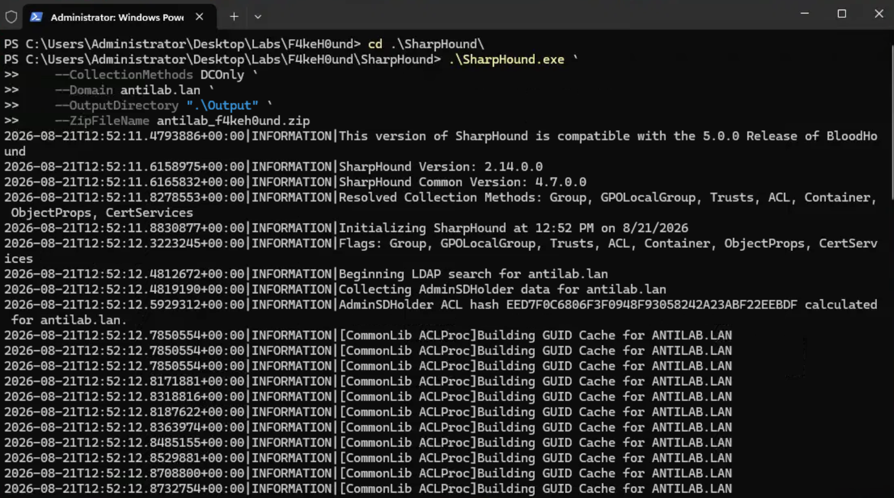

Once the collection is complete, list the contents of the output directory to identify the generated ZIP file:

```powershell
ls .\Output\
```

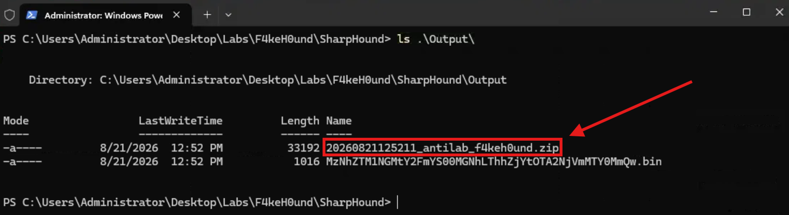

>[!IMPORTANT]
>
> The generated filename may include a different timestamp. Use the exact ZIP filename created in your `Output` folder.

Extract the SharpHound ZIP file into the `Extracted` directory:

```powershell
Expand-Archive .\Output\20260821125211_antilab_f4keh0und.zip -DestinationPath .\Output\Extracted
```

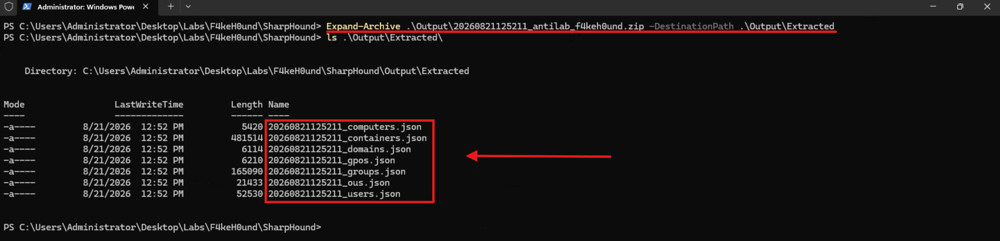

We can now see the extracted JSON files produced by SharpHound. These files will later be used by F4keH0und to propose potential decoy objects.

## F4keH0und Configuration

Because this is a lab for demonstration purposes, the Active Directory environment we setup doesn't fully represent a production environment. The fact that we have just setup the Active Directory environment introduces limitations related to the objects' SIDs/RIDs and their age.

By default, F4keH0und considers an object suitable for recycling only if it meets a minimum age requirement. In our lab, the recyclable objects were created recently, so they would normally be rejected by these checks. For this reason, we have preconfigured F4keH0und to allow recently created objects to be considered for recycling.

In a production environment, these safety settings should normally remain at their default values unless there is a specific reason to modify them.

Before moving on to the **F4keH0und Analysis** section we have to import the F4keH0und module to the Powershell.

In the same PowerShell window from the previous steps execute the following commands:

```powershell
cd ..
Import-Module ".\F4keH0und\F4keH0und.psd1" -Force
```

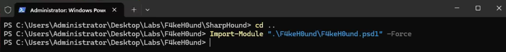

Then validate that the module imported correctly.

```powershell
Get-Module F4keH0und
Get-Command -Module F4keH0und
```

You should see the following output.

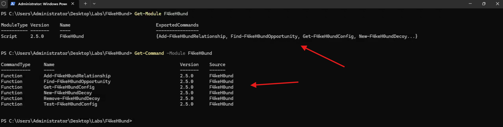

## F4keH0und Analysis

Now that the Active Directory data has been collected with SharpHound and F4keH0und has been configured for our lab environment, we can begin analysing the collected dataset.

First, define the path containing the extracted SharpHound JSON files:

```powershell
$BHPath = "C:\Users\Administrator\Desktop\Labs\F4keH0und\SharpHound\Output\Extracted"
```

The `$BHPath` variable stores the location of the SharpHound dataset that F4keH0und will analyse.

Next, analyse the dataset and store the discovered deception opportunities in the `$opportunities` variable:

```powershell
$opportunities = Find-F4keH0undOpportunity `
    -BloodHoundPath $BHPath `
    -PreferRecycling `
    -Verbose
```

The parameters used in this command are:

- `-BloodHoundPath $BHPath`: Specifies the directory containing the SharpHound JSON files that F4keH0und will analyse.
- `-PreferRecycling`: Tells F4keH0und to prioritise suitable existing Active Directory objects that can be recycled into decoys instead of creating new objects.
- `-Verbose`: Displays additional information while the analysis is performed, allowing us to observe how F4keH0und processes the environment and searches for suitable candidates.

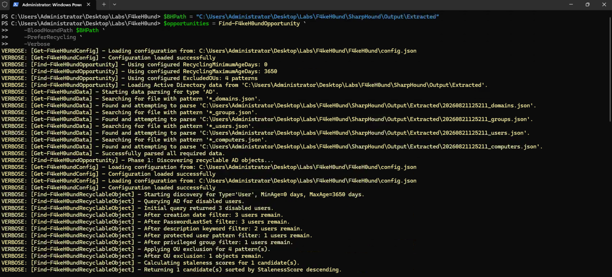

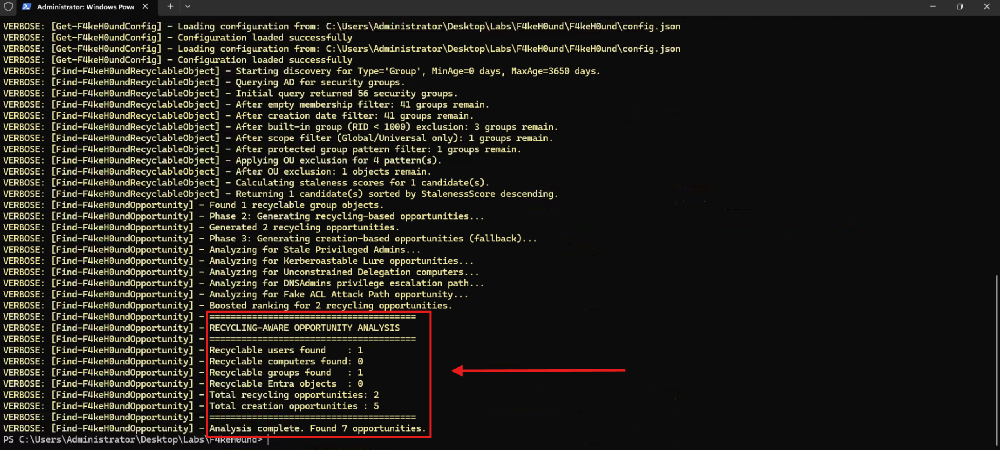

The discovered opportunities are stored in the `$opportunities` variable. Display the most relevant information in a table:

```powershell
$opportunities | Format-Table ID, DecoyType, Rank, Strategy, RecyclableObject -AutoSize
```

The table allows us to compare the available deception opportunities:

- `ID`: Identifies each opportunity and allows us to reference a specific one later.
- `DecoyType`: Shows the type of deception object that F4keH0und can deploy.
- `Rank`: Indicates the priority or value assigned to the opportunity by F4keH0und.
- `Strategy`: Shows whether the opportunity uses an existing object through recycling or requires the creation of a new object.
- `RecyclableObject`: Identifies the existing Active Directory object that can be repurposed when the recycling strategy is available.

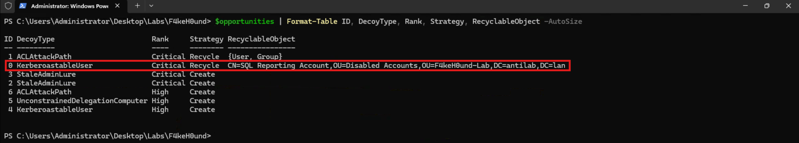

Because we used the `-PreferRecycling` parameter, recycling opportunities are prioritised when suitable objects are available. In our environment, F4keH0und identifies the stale `svc_sql_reports` service account as a candidate that can be recycled into a **KerberoastableUser** decoy.

In the **Active Directory Administrative Center**, inspect this user object before deploying the decoy. Navigate to the **Disabled Accounts** folder and double-click the **SQL Reporting Account** object to view its properties. At this stage, we can confirm that the account is disabled and review details such as its name, `sAMAccountName`, creation time, and SID before it is recycled by F4keH0und.

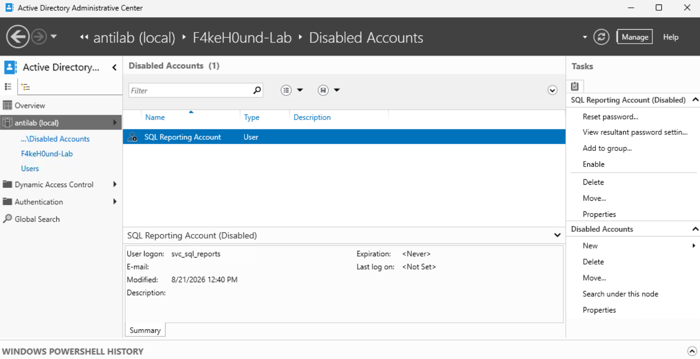

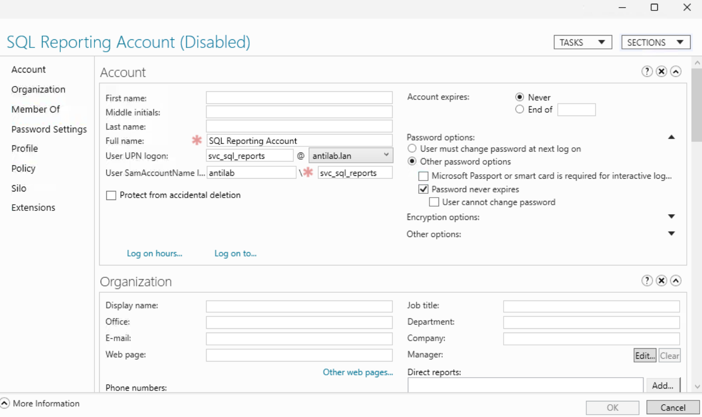

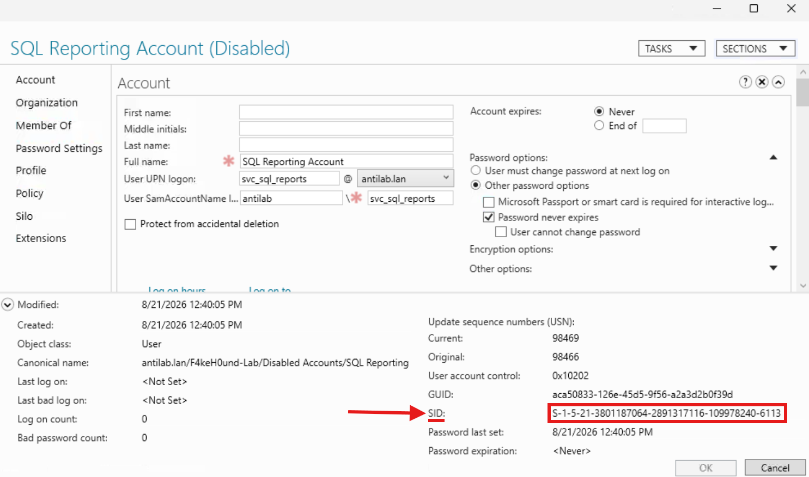

Notice that the object's SID ends with the RID `6113`. Because F4keH0und will recycle this existing object rather than create a new one, its SID, RID, and original creation timestamp are preserved. We will compare these properties again after the decoy has been deployed.

## Performing a Dry Run

Before deploying the decoy and making changes to Active Directory, we will perform a dry run. This allows us to inspect the selected Kerberoastable opportunity and simulate the deployment process without modifying any Active Directory objects.

First, filter the discovered opportunities and select the one that represents a recycled **KerberoastableUser**:

```powershell
$kerb = $opportunities |
    Where-Object {
        $_.DecoyType -eq "KerberoastableUser" -and
        $_.Strategy -eq "Recycle"
    }
```

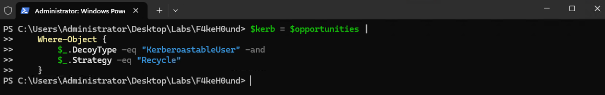

In our lab environment, this selects the opportunity that will recycle the `svc_sql_reports` account into a Kerberoastable decoy.

Display the details of the selected opportunity:

```powershell
$kerb | Format-List ID, DecoyType, Rank, Strategy, RecyclableObject, Template
```

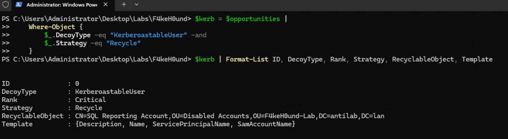

This allows us to review the opportunity before deployment, including the ID of the opportunity, the decoy type, deployment strategy, recyclable Active Directory object, and the template that F4keH0und intends to apply. Note that the ID of the opportunity is **0**, as we will use it in the next step.

We can also inspect the Service Principal Name that will be assigned to the decoy:

```powershell
$kerb.Template.ServicePrincipalName
```

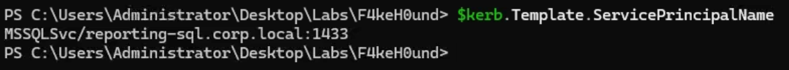

The SPN is an important part of the **KerberoastableUser** decoy because it makes the account discoverable as a Kerberos-enabled service account during Active Directory enumeration.

Now perform the F4keH0und deployment as a dry run:

```powershell
New-F4keH0undDecoy `
    -BloodHoundPath $BHPath `
    -Execute `
    -PreferRecycling `
    -WhatIf `
    -Verbose
```

F4keH0und identifies the available deception opportunities and prompts us to select the one we want to deploy. Enter `0` to select the recycled **KerberoastableUser** opportunity identified earlier.

The parameters used in this command are:

- `-BloodHoundPath $BHPath`: Specifies the directory containing the SharpHound data used to identify the deception opportunities.
- `-Execute`: Tells F4keH0und to proceed through the deployment workflow rather than only analysing the available opportunities.
- `-PreferRecycling`: Prioritises the recycling of suitable existing Active Directory objects.
- `-WhatIf`: Simulates the deployment and displays the changes that would be performed without actually applying them to Active Directory.
- `-Verbose`: Displays additional information about the actions F4keH0und evaluates during the dry run.

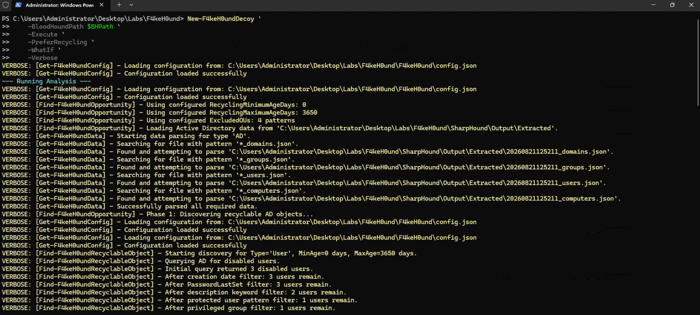

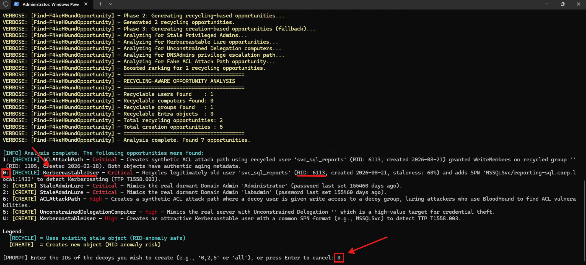

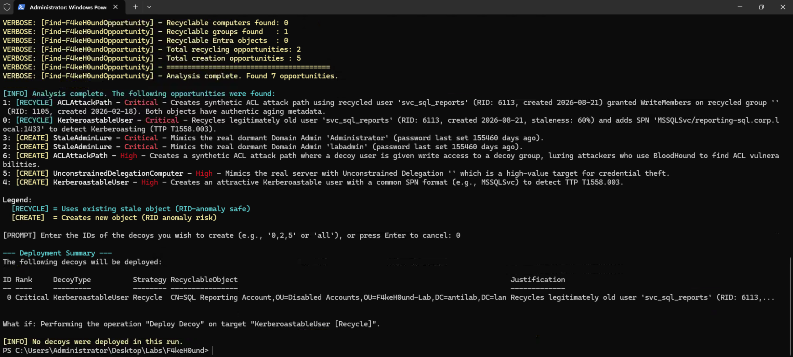

Because the command was executed with the `-WhatIf` parameter, F4keH0und only simulates the deployment. The message `What if: Performing the operation "Deploy Decoy"...` shows the action that would have been performed, while `No decoys were deployed in this run` confirms that no changes were made to Active Directory.

To verify that the dry run did not modify the recyclable account, query the object directly from Active Directory:

```powershell
Get-ADUser `
    -Identity $kerb.RecyclableObject.SamAccountName `
    -Properties ServicePrincipalName,Enabled,Description |
    Format-List SamAccountName,Enabled,Description,ServicePrincipalName
```

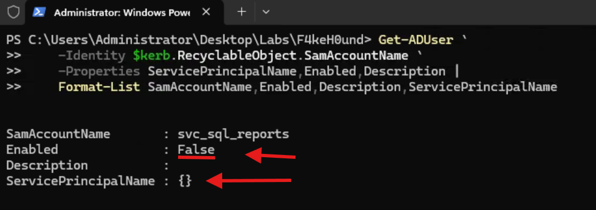

The account is still disabled and does not yet contain the Service Principal Name that F4keH0und intends to assign during deployment.

The dry run therefore allows us to review the planned deployment and verify the actions F4keH0und intends to perform before making any actual changes to Active Directory.

## Deploying a Kerberoastable Decoy

Now that we have reviewed the selected opportunity with a dry run, we can perform the actual deployment. This time, we will execute the deployment without the `-WhatIf` parameter, allowing F4keH0und to make the required changes to Active Directory.

Execute:

```powershell
New-F4keH0undDecoy `
    -BloodHoundPath $BHPath `
    -Execute `
    -PreferRecycling `
    -Verbose
```

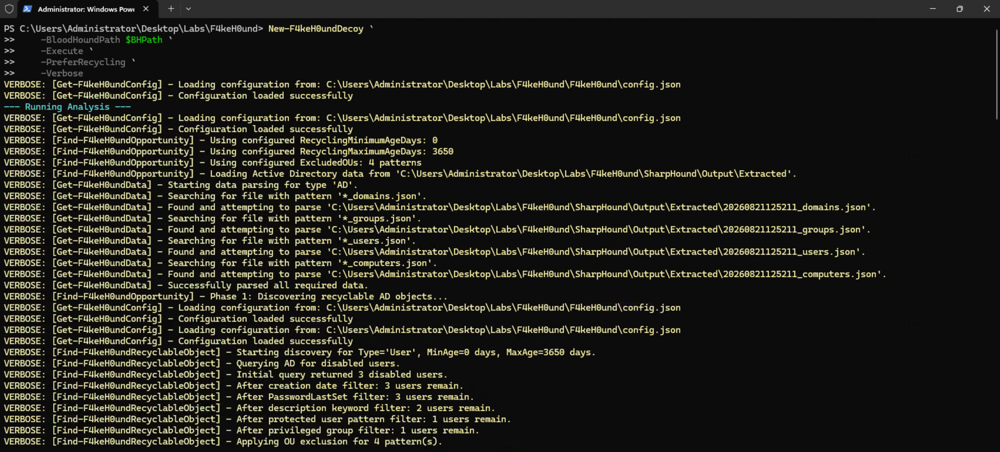

F4keH0und will again display the available deception opportunities and prompt us to select the decoy we want to deploy. Enter the same opportunity ID identified during the previous steps to select the recycled **KerberoastableUser**.

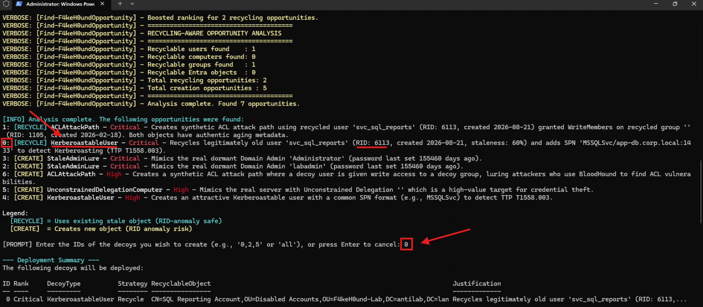

You will then be prompted three more times to confirm the deployment actions. Enter `Y` at each prompt to continue.

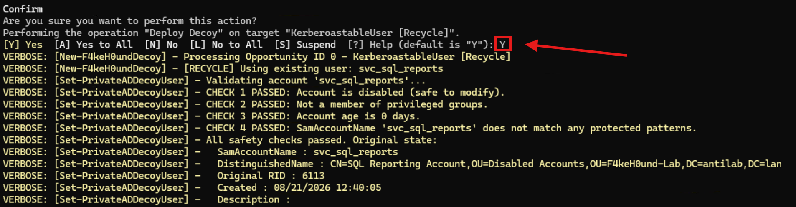

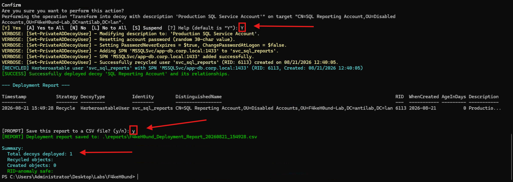

At the end of the execution, F4keH0und displays the total number of successfully deployed decoys.

F4keH0und also generates a CSV deployment report containing information about the deployed decoy, such as the deployment strategy, decoy type, identity, RID, and assigned SPN. We can inspect this report to confirm the details of the deployed decoy.

```powershell
Get-ChildItem "C:\Users\Administrator\Desktop\Labs\F4keH0und\reports"
```

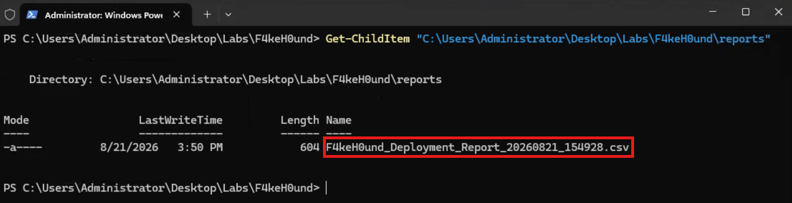

>[!IMPORTANT]
>
> The timestamp in the report filename will be different in your environment. Use the exact CSV filename generated during your deployment.

```powershell
Get-Content "C:\Users\Administrator\Desktop\Labs\F4keH0und\reports\F4keH0und_Deployment_Report_20260821_154928.csv"
```

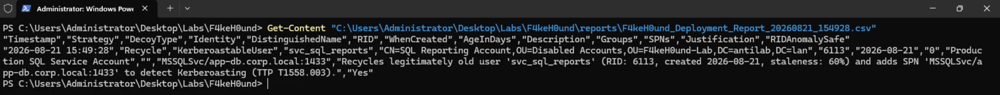

After the deployment completes, query the object directly from Active Directory to verify the changes:

```powershell
Get-ADUser `
    -Identity $kerb.RecyclableObject.SamAccountName `
    -Properties ServicePrincipalName,Enabled,Description,SID,whenCreated |
    Format-List SamAccountName,Enabled,Description,ServicePrincipalName,SID,whenCreated
```

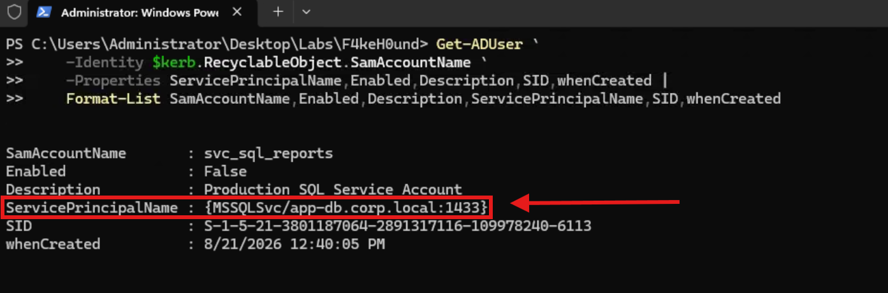

The `ServicePrincipalName` now contains the SPN configured by F4keH0und, confirming that the account has been transformed into a Kerberoastable decoy.

Notice also the `SID` and `whenCreated` properties. The RID can be identified as the final numerical component of the SID; in our case, the SID ends in `6113`, making the RID `6113`. Because F4keH0und recycled the existing object instead of creating a new one, its SID, RID, and original creation timestamp are preserved from the `svc_sql_reports` account that we inspected before deployment.

The RID should remain unchanged from the value observed before deployment, demonstrating that F4keH0und recycled the original Active Directory object rather than replacing it with a newly created account.

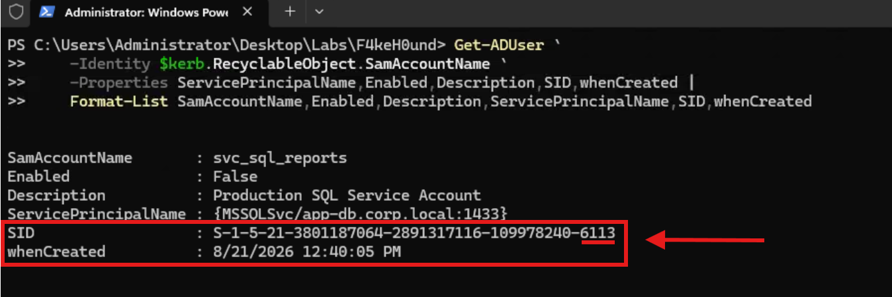

From the previous `Get-ADUser` output, we can also see that the `Enabled` property is currently set to `False`.

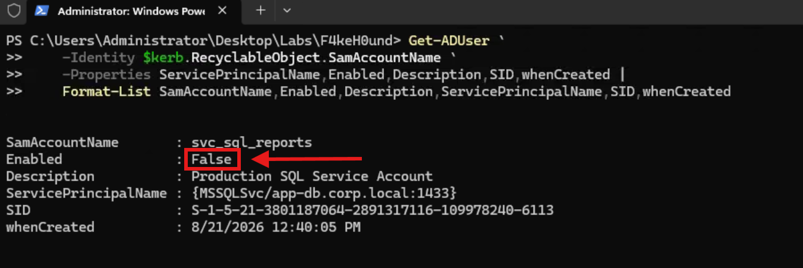

Enable the decoy account for the next phase of the lab:

```powershell
Enable-ADAccount -Identity svc_sql_reports
```

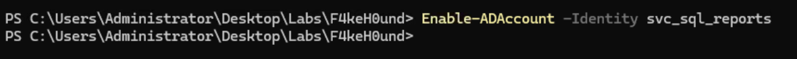

Verify that the account is now enabled:

```powershell
Get-ADUser -Identity svc_sql_reports -Properties Enabled |
    Select-Object SamAccountName, Enabled
```

The `Enabled` property should now return `True`.

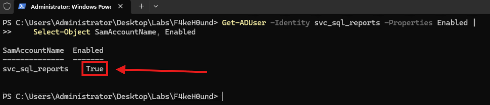

## Enumerating Active Directory from Ubuntu

Now that the **KerberoastableUser** decoy has been deployed, switch to the Ubuntu terminal.

For this lab, we assume that the credentials of the low-privileged `student` domain user have already been compromised. We will use these credentials to authenticate to Active Directory, enumerate Kerberos service accounts, discover the decoy, and finally interact with it.

First, verify that the provided `student` credentials can successfully authenticate to the domain:

```bash
GetADUsers.py antilab.lan/student -dc-ip 10.10.112.203 -all
```

>[!NOTE]
>
>Your IP will be different. Use yours!

When prompted, enter the password for the `student` account. Use the credentials obtained in the **Preparing Active Directory** section (username: `student`, password: `FakehoundStudent123!`).

The command uses the following values:

- `antilab.lan/student`: Specifies the Active Directory domain and the domain user used for authentication.
- `-dc-ip 10.10.112.203`: Specifies the IP address of the Domain Controller.
- `-all`: Displays all domain users returned by the query.

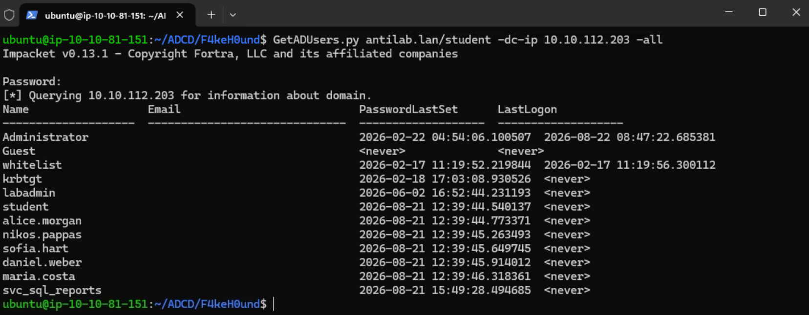

A successful response confirms that the `student` credentials are valid and that the Ubuntu VM can communicate with the Domain Controller.

Next, enumerate domain accounts that have a **Service Principal Name (SPN)** configured:

```bash
GetUserSPNs.py antilab.lan/student -dc-ip 10.10.112.203
```

`GetUserSPNs.py` queries Active Directory for user accounts associated with SPNs. Such accounts are interesting from an attacker's perspective because they can potentially be targeted through Kerberoasting.

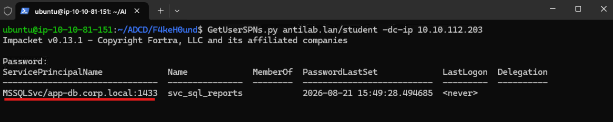

As we can see, we discovered the `svc_sql_reports` account that F4keH0und recycled into our **KerberoastableUser** decoy. Its SPN makes the account appear as a service account and therefore makes it visible during this type of enumeration.

At this stage, we have only discovered the decoy. To interact with it, request a Kerberos service ticket specifically for the `svc_sql_reports` account:

```bash
GetUserSPNs.py antilab.lan/student -dc-ip 10.10.112.203 -request-user svc_sql_reports
```

The `-request-user` parameter tells Impacket to request a Ticket Granting Service (TGS) ticket for the specified account rather than only listing accounts with SPNs.

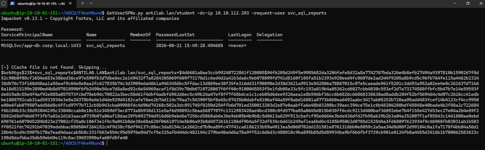

This request represents the interaction with our decoy. From the attacker's perspective, `svc_sql_reports` appears to be an ordinary Kerberoastable service account. From the defender's perspective, however, it is a known deception object that legitimate users and services should not need to target.

The returned Kerberos ticket confirms that the TGS request for the `svc_sql_reports` decoy was successful.

The Domain Controller processes the ticket request and records the Kerberos activity in the Windows Security log.

## Detecting the Kerberos Request

F4keH0und does not generate the Kerberos event itself. When a user requests a Kerberos service ticket (TGS), the Domain Controller can log the request as **Event ID 4769**, regardless of whether the target account is a decoy.

The advantage of the F4keH0und decoy is that legitimate users and services should have no reason to request a ticket for it. Therefore, a **4769** event targeting the decoy account is a high-confidence indicator of suspicious activity.

In the Windows VM, open **Event Viewer** and navigate to:

```
Windows Logs → Security
```

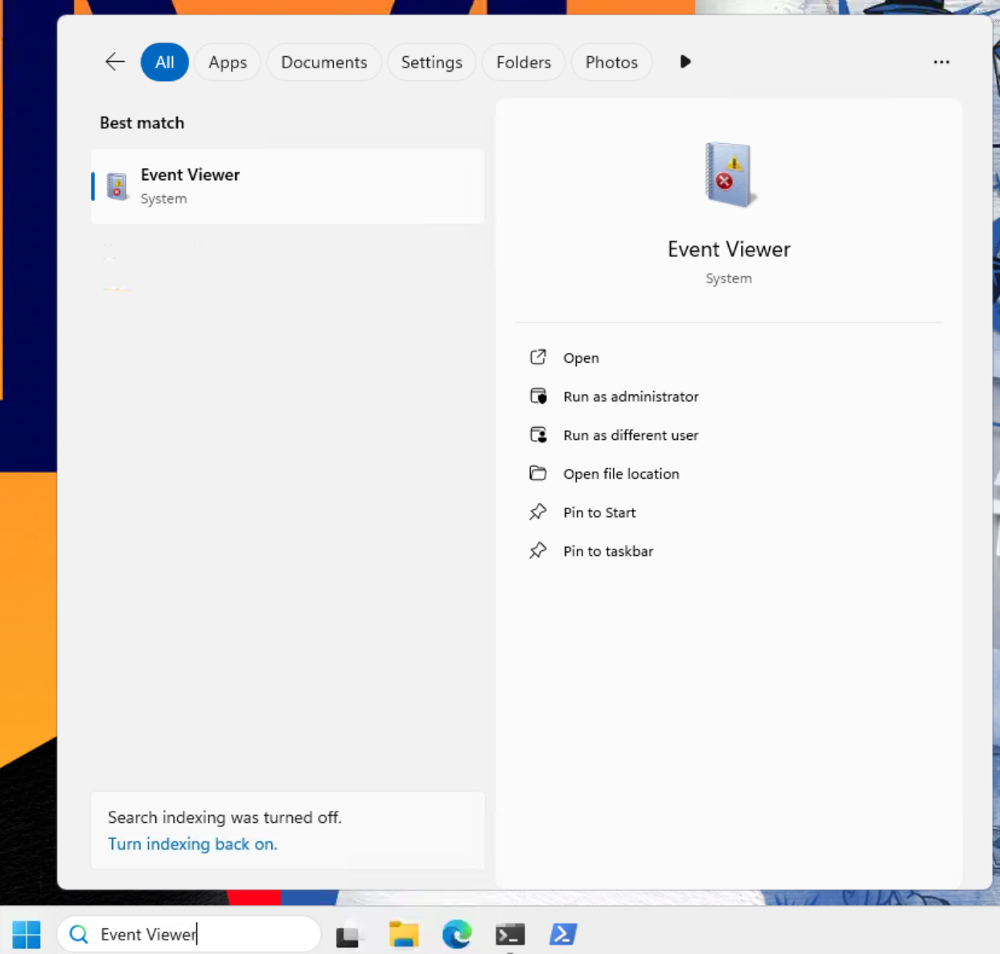

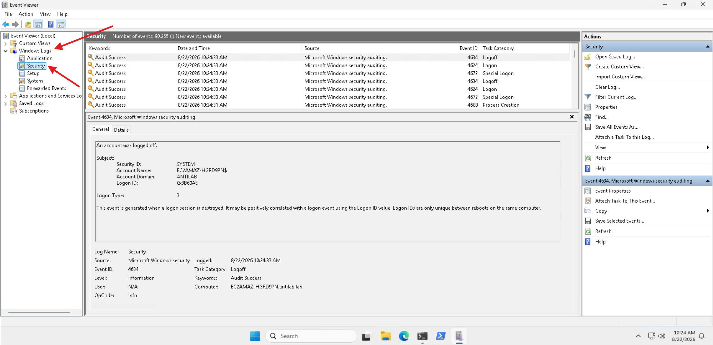

To make the event easier to locate, select **Filter Current Log...** from the Actions panel and enter `4769` in the **Event IDs** field.

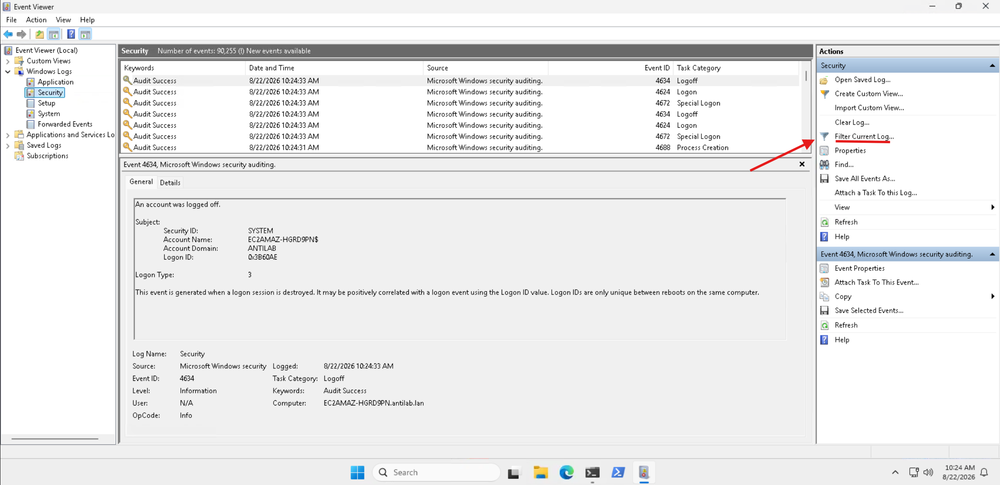

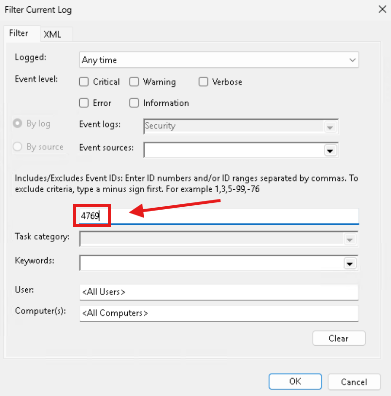

Then press **OK** to apply the filter.

The event at the top of the list corresponds to the Kerberos request we performed from the Ubuntu VM. Open it to inspect its details.

Pay attention to the following fields:

- **Account Name**: Identifies the account that requested the ticket. In our case, this is `student`.
- **Service Name**: Identifies the service account targeted by the request. In our case, this corresponds to the `svc_sql_reports` decoy.
- **Client Address**: Identifies the source IP address from which the request originated. This corresponds to our Ubuntu VM.

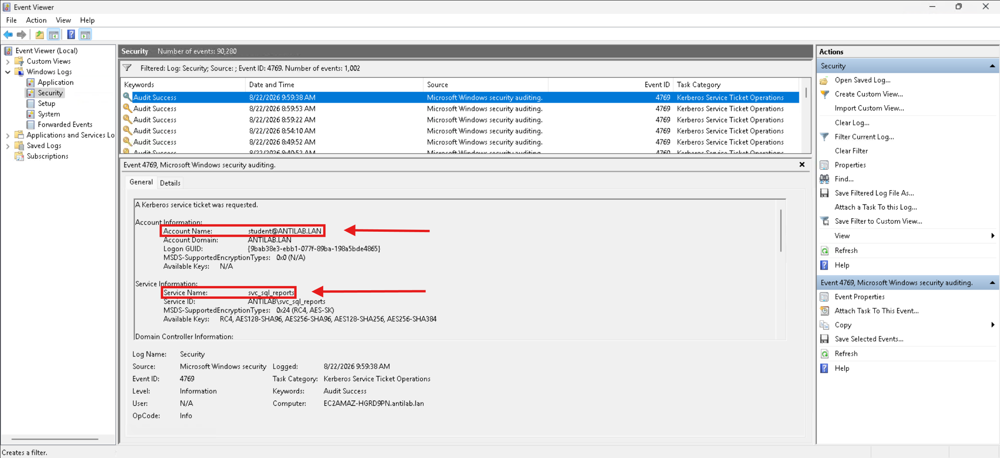

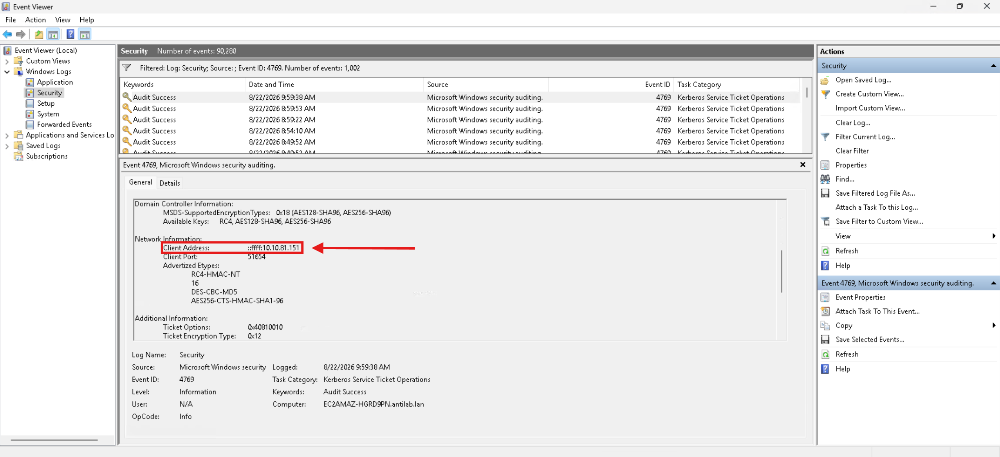

These values allow us to determine **who requested the ticket, which service account was targeted, and where the request originated**. Since `svc_sql_reports` is a known F4keH0und decoy, this 4769 event represents a suspicious interaction with the deception object.

We can now correlate the Windows event with the deployment information recorded by F4keH0und.

First, locate the F4keH0und deployment report:

```powershell
$Report = Get-ChildItem "C:\Users\Administrator\Desktop\Labs\F4keH0und\reports\F4keH0und_Deployment_Report_20260821_154928.csv"
```
>[!NOTE]
>
> Use the exact CSV file generated during your deployment.

Then display its contents:

```powershell
Import-Csv $Report.FullName | Format-List
```

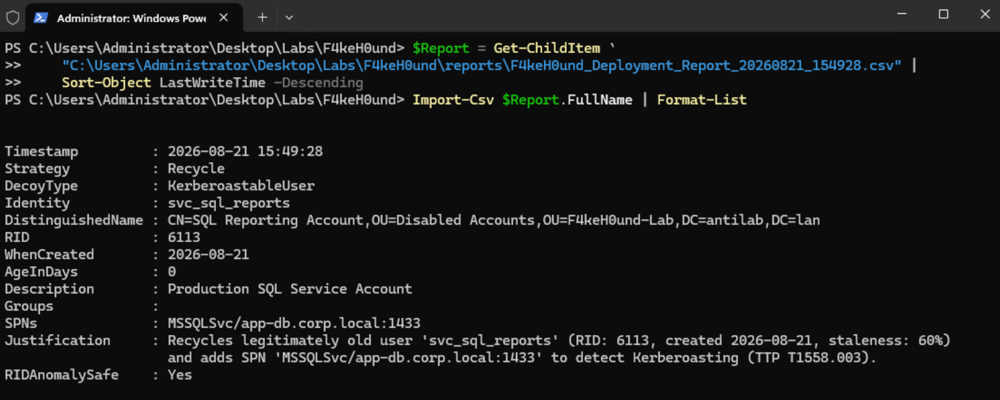

The report confirms that `svc_sql_reports` was deployed as a **KerberoastableUser** decoy using the **Recycle** strategy and records the SPN assigned to it.

By correlating this information with **Event ID 4769**, we can confirm that the Kerberos service-ticket request observed in the Security log targeted the decoy deployed by F4keH0und.


***                                                                 
<b><i>Looking for a different lab? </br>[Lab Directory](/IntroClassFiles/navigation.md)</i></b>

***Finished with the Labs?***

Please be sure to destroy the lab environment!

[Click here for instructions on how to destroy the Lab Environment](/IntroClassFiles/Tools/IntroClass/LabDestruction/labdestruction.md)

---
